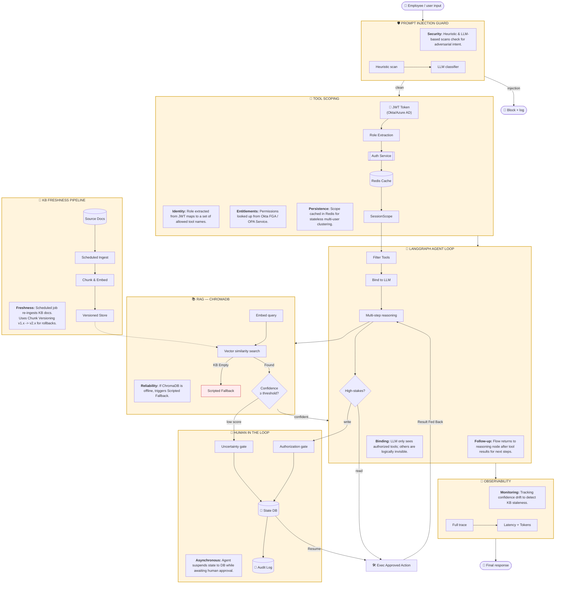
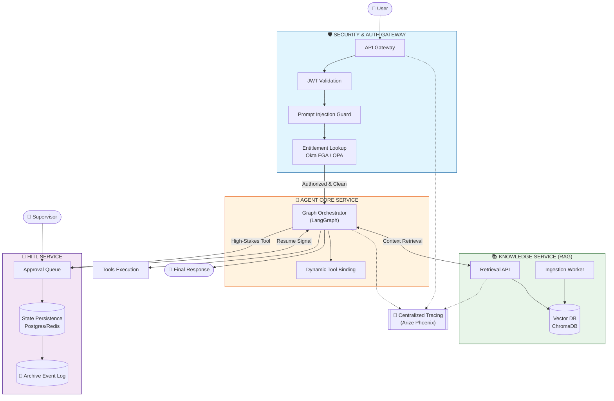

# PRD: Enterprise-Ready IT Helpdesk Agent

## 1. Introduction
The Enterprise-Ready IT Helpdesk Agent is a professional-grade assistant designed to resolve employee IT issues autonomously while maintaining strict security, observability, and reliability standards. It moves beyond simple "chatbots" by implementing robust guardrails, human-in-the-loop (HITL) workflows, and automated reliability patterns.

## 2. Core Pillars

### A. RAG (Retrieval-Augmented Generation)
- Uses ChromaDB to store and retrieve IT knowledge base (KB) articles.
- Implements semantic search to provide the agent with grounded, company-specific context.

### B. Observability (Arize Phoenix)
- Full OpenTelemetry-based tracing for every agent turn.
- Detailed breakdown of latency, token usage, and tool call accuracy.

### C. Security Guardrails
- **Prompt Injection Guard**: Heuristic and LLM-based scans for adversarial inputs.
- **Tool Scoping**: Role-based access control (RBAC) ensuring analysts can only read data, while supervisors can execute "high-stakes" actions.

## 3. Enterprise Features (The "Reliability Layer")

- **KB Freshness Pipeline**: A scheduled job that re-ingests changed KB articles. It uses **Chunk Versioning** (v1.x -> v2.x) to allow rolling back to a known-good embedding set if retrieval quality degrades.
- **Graceful Degradation**: 
    - **Database Failure**: If ChromaDB is empty or unreachable, the agent returns a scripted fallback: *"I'm having trouble right now — please call ext. 4357"*.
    - **LLM Failure**: If the LLM provider returns a rate-limit (429) or overload (503) error, the agent defaults to the same fallback instead of crashing.
- **Persistent Audit Log**: Every Human-in-the-Loop decision (approved/rejected) is recorded to an append-only Postgres store with row-level security. This is a mandatory requirement for **SOC 2** and other compliance frameworks.
- **Identity & Auth**: Planned integration with enterprise IdPs (Okta/Azure AD) to derive `SessionScope` roles from verified JWTs.
- **Rate Limiting**: Per-user token budgets and request quotas to prevent abuse or compromised accounts from flooding the system.
- **Retrieval Monitoring**: Tracking confidence score distribution to detect "embedding drift" or KB staleness before users encounter errors.
- **Red-Team Testing**: Automated CI suite targeting guardrails with known injection payloads.

## 4. User Stories

### US-001: Automated Knowledge Refresh
**Description:** As an IT Manager, I want the agent's knowledge to be updated automatically every night so that it doesn't provide outdated VPN or password reset instructions.
**Acceptance Criteria:**
- [ ] Pipeline runs on a schedule (Cron/Job).
- [ ] New articles are embedded and versioned.
- [ ] Rollback strategy is defined (can point to version N-1).

### US-002: Service Interruption Fallback
**Description:** As an Employee, I want the agent to give me a phone number if it's "feeling sick" rather than hallucinating a wrong answer or crashing with a technical error.
**Acceptance Criteria:**
- [ ] If ChromaDB query fails/returns empty, respond with fallback message.
- [ ] If LLM rate limit is hit, respond with fallback message.

### US-003: Compliance Evidence (Audit Log)
**Description:** As a Compliance Officer, I want to see a log of every time a human approved a "high-stakes" tool call so we can pass our SOC 2 audit.
**Acceptance Criteria:**
- [ ] Record Decision, Timestamp, Tool, Reviewer, and Reason.
- [ ] Data stored in a persistent, append-only database.

## 5. Functional Requirements

- **FR-1:** The system must perform a semantic search before answering any IT-related query.
- **FR-2:** Every tool call requiring a "write" action (e.g., `create_ticket`) must pause for HITL approval.
- **FR-3:** All HITL decisions must be logged to the persistent `audit_log` table.
- **FR-4:** The `AgentNode` must catch `RateLimitException` and return the `FALLBACK_RESPONSE`.

## 6. Non-Goals
- Real-time indexing of file changes (staying with scheduled/manual ingestion for stability).
- End-user identity verification within this prototype (handled via hardcoded session roles).
- Support for non-English KB articles in the initial version.

## 7. Microservice Decomposition

In a production environment, this architecture is distributed across independent services to ensure scalability and fault isolation.

| Service | Component Responsibility | Communications |
| :--- | :--- | :--- |
| **Gateway / Security** | Prompt Injection (PIG), JWT Auth, and Entitlements (Okta/OPA). | Synchronous REST / gRPC |
| **Agent Orchestrator** | Multi-step reasoning (LangGraph), Tool steering, and State Management. | Websockets / Async REST |
| **Knowledge (RAG)** | ChromaDB retrieval, Confidence scoring, and Ingestion (KFP). | Internal API |
| **HITL Service** | Approval Dashboard, State Checkpointing (Redis), and Audit Logging. | Event-driven (Webhooks/MQ) |

