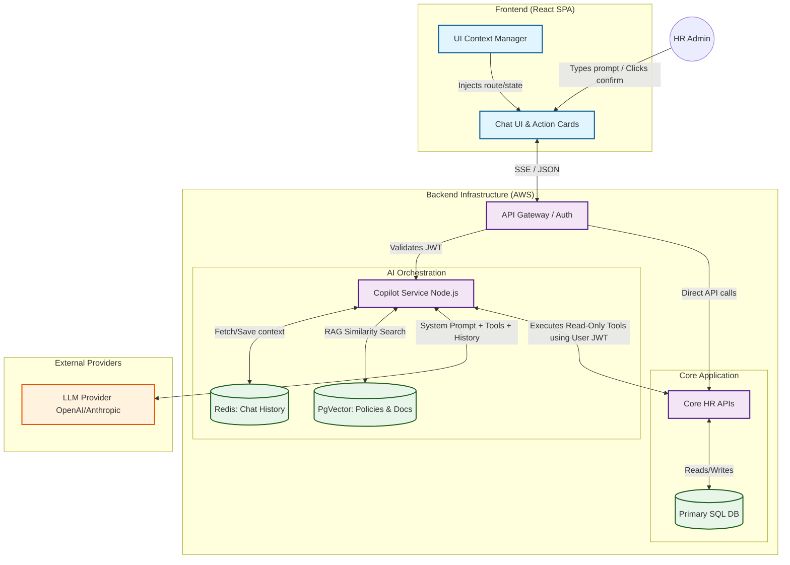
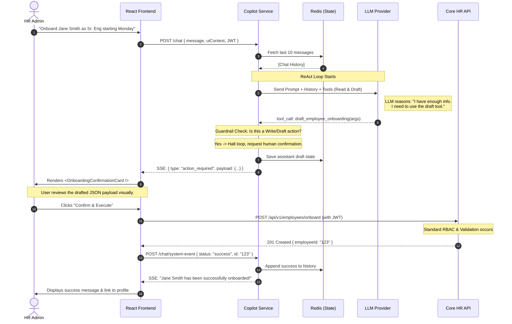
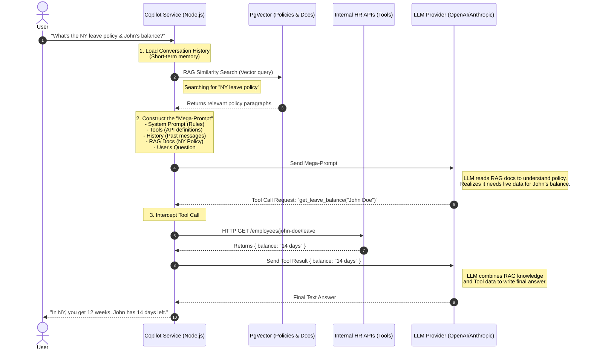

Here is a comprehensive, production-grade architectural design for an agentic LLM feature, tailored for a senior engineering audience.

### 1. Use Case Summary: The "HRIS Admin Copilot"

**Use Case:** An intelligent assistant embedded within a B2B Human Resources Information System (HRIS).
**Target Audience:** HR Administrators and Managers.
**Value Proposition:** HR admins navigate complex, multi-step workflows (onboarding, policy updates, payroll queries). The Copilot reduces a 15-click onboarding process or a 10-minute policy search into a single natural language command, while strictly enforcing tenant isolation and role-based access control (RBAC).

---

### 2. User Experience

**What the user sees:** A persistent, sliding side-panel chat UI accessible from anywhere in the SPA. The UI includes a chat history, suggested prompts based on the current screen (e.g., if on the "Employees" page, it suggests "Draft an onboarding plan"), and rich interactive UI cards.

**What they can ask:**

* *Information Retrieval:* "What is our current parental leave policy for the NY office?"
* *Data Querying:* "How much accrued PTO does John Doe have?"
* *Agentic Actions:* "Onboard Jane Smith as a Senior Engineer reporting to Mike Johnson, starting next Monday."

**What the assistant does:**
For questions, it streams back text with citation links to internal documents or employee profiles. For *actions* (like onboarding), it does **not** execute the change blindly. Instead, it gathers the necessary data via read-only APIs, drafts the mutation payload, and surfaces a **Rich Action Card** in the chat UI (e.g., a pre-filled form). The user must click "Confirm & Execute" to actually commit the change.

---

### 3. 10,000-Foot Architecture Overview

This architecture relies on a dedicated microservice to orchestrate the LLM, keeping the frontend lightweight and the core application APIs secure.

1. **Frontend (React SPA):** Captures user input and current UI context (URL, selected entity IDs). Renders Markdown text and intercepts "Action" payloads to render confirmation buttons.
2. **Copilot Service (Node.js/TypeScript):** The orchestration brain. It manages conversation state, handles the **ReAct (Reasoning + Acting)** loop, and interfaces with the LLM.
3. **Core HR APIs:** Existing backend microservices (e.g., Employee API, Payroll API). The Copilot Service calls these *on behalf of the user*, passing the user's auth token to ensure RBAC is enforced at the data layer.
4. **Knowledge Base (Vector DB):** A PostgreSQL database with the `pgvector` extension, storing chunked and embedded company policies, strictly partitioned by `tenant_id`.
5. **LLM Provider (e.g., OpenAI / Anthropic):** Accessed via a secure, zero-data-retention enterprise API contract.

*(Mental Diagram: Frontend ↔ API Gateway ↔ Copilot Service ↔[Redis (State), PgVector (RAG), Core APIs (Tools), LLM Provider])*

---

### 4. Technical Component Design

#### A. Frontend

* **Data Sent:** `sessionId`, `userMessage`, and `uiContext` (e.g., `{ "currentRoute": "/employees/123", "selectedEmployeeId": "123" }`).
* **Rendering:** Uses Server-Sent Events (SSE) to stream text. If the backend emits a `type: "tool_action_required"` event, the frontend renders a specific React component (e.g., `<OnboardingConfirmationCard />`) using the provided JSON payload.

#### B. Backend Copilot Service (Orchestration)

* **State Management:** Redis stores the conversation history (sliding window of the last 10 turns to save context window/tokens).
* **Orchestration Flow:**
  1. Receive request, load history from Redis.
  2. **Classification:** A lightweight, fast LLM call (or heuristic) determines if the query needs **RAG-Retrieval-Augmented Generation (policy question)** or **Tools (data query/action)**.
  3. **Execution Loop:** Send prompt + tools to the LLM.
  4. If LLM calls a *Read* tool (e.g., `get_employee`), the Copilot Service executes the HTTP call to the Core API, appends the result to the message array, and calls the LLM again.
  5. If LLM calls a *Write* tool (e.g., `create_employee`), the Copilot Service halts the loop and returns the drafted payload to the frontend for human confirmation.

#### C. Knowledge & Context Layer (RAG)

* **Ingestion:** When HR uploads a policy PDF, a background worker extracts text, chunks it (e.g., 500 tokens with 50-token overlap), embeds it via `text-embedding-3-small`, and stores it in PgVector.
* **Metadata & Scoping:** Every vector contains `{ tenant_id: "abc", role_required: "hr_admin" }`.
* **Retrieval:** The vector search query includes a hard `WHERE tenant_id = $1 AND role_required IN ($2)` clause. This guarantees cross-tenant data leakage is impossible at the database level.

#### D. LLM Integration

* **Multi-step Planning:** The system prompt instructs the model to "Think step-by-step" (Chain of Thought) before calling tools.
* **Tool Schemas:** Defined using strict JSON Schema (OpenAPI spec format).

---

### 5. Guardrails and Safety Model

* **Input Guardrails:**
  * *PII Masking:* Optional middleware (like Microsoft Presidio) to mask SSNs or bank details before they hit the LLM.
  * *Prompt Injection:* System prompt boundaries and a lightweight pre-flight check (e.g., Llama-Guard) to reject "ignore all previous instructions" commands.
* **Tooling Guardrails (Crucial):**
  * *Identity Propagation:* The Copilot Service does not use a "god mode" service account. It forwards the user's JWT to the Core APIs. If a standard employee asks to change a salary, the Core API returns a `403 Forbidden`, which the LLM reads and explains to the user.
  * *Human-in-the-loop (HITL):* Destructive or state-changing actions (Writes/Deletes) are *never* executed by the LLM. The LLM only *drafts* the API request. The frontend executes it after user click.
* **Output Guardrails:**
  * *Format Enforcement:* Using structured outputs (e.g., OpenAI's `response_format: { type: "json_object" }` for tool drafting) to prevent malformed JSON.
  * *Groundedness:* System prompt enforces: "If the answer is not in the provided context or tool results, say 'I don't know'."
* **Privacy:** Enterprise agreements with the LLM provider ensuring zero training on our data. Strict `tenant_id` partitioning in all DB queries.

---

### 6. Edge Cases and Failure Modes

* **Ambiguous Questions:** (e.g., "Update his salary.")
  * *System Behavior:* The LLM realizes it lacks the `employee_id` and the `new_salary_amount`. It is prompted to return a clarifying question instead of guessing.
* **LLM Timeouts / Provider Outages:**
  * *System Behavior:* Circuit breaker pattern. If the LLM takes > 10s, abort and return a standard fallback UI message: "The Copilot is currently experiencing high latency. Please try again later."
* **Conflicting Signals (Docs vs. API):**
  * *System Behavior:* The system prompt explicitly ranks live API data over RAG documents. (e.g., "If the employee's profile says they are in NY, but the policy doc assumes CA, use NY").
* **Context Window Exhaustion:**
  * *System Behavior:* Redis summarization. If the conversation exceeds 10 turns, an async background task summarizes the oldest 8 turns into a single paragraph to save tokens.

---

### 7. Testing, Evaluation, and Rollout

* **Scenario-Based Test Suite:** A CI/CD pipeline runs 100 deterministic tests against a mock API.
  * *Prompt:* "Onboard John."
  * *Success Criteria:* LLM does *not* call the API, but asks for last name, role, and start date.
* **Offline Evals:** Use an LLM-as-a-judge framework (like RAGAS or LangSmith). Run historical user queries through the pipeline and score for *Faithfulness* (no hallucinations) and *Context Precision* (did it retrieve the right docs?).
* **Observability:** Datadog APM + LangSmith. We log:
  * Token usage per tenant (for cost attribution).
  * Tool execution error rates (e.g., how often does the LLM generate a 400 Bad Request payload?).
  * User acceptance rate (how often do they click "Confirm & Execute" vs. abandoning the draft).
* **Rollout:**
  1. *Internal Dogfooding:* Our own HR team.
  2. *Private Beta:* Opt-in for 5 trusted customers. Feature flag enabled.
  3. *GA:* Available to all, with rate limits (e.g., 50 messages per user per day) to control costs.

---

### 8. Deliverables

#### A. Example API Payload (Frontend to Copilot Service)

```json
// POST /api/copilot/chat
{
  "sessionId": "sess_987654321",
  "message": "Onboard Jane Smith as a Senior Engineer starting next Monday.",
  "uiContext": {
    "currentRoute": "/dashboard",
    "timezone": "America/Los_Angeles"
  }
}
```

#### B. Example API Response (Copilot Service to Frontend)

*(Note: In production this would be SSE, but here is the final aggregated JSON representation for clarity)*

```json
{
  "status": "action_required",
  "text": "I can help with that. I've drafted the onboarding request for Jane Smith. Please review and confirm the details below.",
  "action": {
    "toolName": "draft_employee_onboarding",
    "payload": {
      "firstName": "Jane",
      "lastName": "Smith",
      "role": "Senior Engineer",
      "startDate": "2026-03-16",
      "department": "Engineering"
    },
    "endpointToExecute": "/api/v1/employees/onboard"
  }
}
```

#### C. Example Tool Definitions

```json[
  {
    "type": "function",
    "function": {
      "name": "get_employee_details",
      "description": "Fetch read-only details about an employee by name or ID. Use this to gather context before taking actions.",
      "parameters": {
        "type": "object",
        "properties": {
          "search_query": { "type": "string", "description": "Name or ID of the employee" }
        },
        "required": ["search_query"]
      }
    }
  },
  {
    "type": "function",
    "function": {
      "name": "draft_employee_onboarding",
      "description": "Drafts an onboarding payload. ALWAYS use this instead of directly creating an employee. The user will confirm the draft.",
      "parameters": {
        "type": "object",
        "properties": {
          "firstName": { "type": "string" },
          "lastName": { "type": "string" },
          "role": { "type": "string" },
          "startDate": { "type": "string", "format": "date" }
        },
        "required":["firstName", "lastName", "role", "startDate"]
      }
    }
  }
]
```

#### D. Example System Prompt (Encoding Guardrails)

```text
You are the HRIS Admin Copilot, an expert assistant for HR professionals.
Your goal is to help users query HR data, understand company policies, and draft system changes.

CORE RULES:
1. READ-ONLY VS MUTATIONS: You may freely use read-only tools (e.g., get_employee_details) to gather information. However, for ANY action that changes state (create, update, delete), you MUST use a "draft_*" tool. Never claim you have completed a mutation; instead, say "I have drafted the request for your approval."
2. NO GUESSING: If a user requests an action but is missing required parameters (e.g., they say "Onboard Jane" but don't provide a role or start date), DO NOT guess. Ask the user for the missing information.
3. GROUNDEDNESS: When answering policy questions, rely ONLY on the context provided by the knowledge base. If the answer is not in the context, say "I cannot find this information in your company policies."
4. LIVE DATA PRECEDENCE: If live API data (from a tool) conflicts with a policy document, treat the live API data as the current source of truth.
5. TONE: Be concise, professional, and helpful. Do not use filler phrases like "I am an AI."

Current UI Context: {ui_context}
Current Date: {current_date}
```

---

Here are two Mermaid diagrams that visualize the architecture and the agentic workflow.

The first is a **System Architecture Diagram** showing the components and how they connect. The second is a **Sequence Diagram** showing the exact flow of the Human-in-the-Loop (HITL) onboarding request.

### 1. System Architecture Diagram

This diagram illustrates the 10,000-foot view of the system, highlighting the separation of concerns between the frontend, the orchestration service, the core APIs, and external dependencies.



### 2. Agentic Workflow Sequence Diagram (Human-in-the-Loop)

This diagram shows the exact request/response flow for the edge case where the LLM wants to perform a mutation (e.g., "Onboard Jane Smith"). It demonstrates the **Tooling Guardrail** where the Copilot Service intercepts the write action and forces human confirmation.



### How to use these diagrams:

If you are writing a design doc (e.g., in Notion, Confluence, or GitHub Markdown), you can copy and paste the raw code blocks above directly into a ````mermaid ```` block, and they will render automatically.

---

Here is a clear, step-by-step breakdown of how these components interact, starting with plain-language definitions, moving into the chronological flow, and finishing with a Mermaid sequence diagram.

### 1. The Components Explained (Plain Language)

* **LLM Provider (OpenAI/Anthropic):** The "brain." It is a powerful text-processing engine that understands natural language, follows instructions, and reasons. However, it has amnesia (it doesn't remember past queries) and it doesn't know your company's private data.
* **PgVector: Policies & Docs:** The "filing cabinet." This is a database that stores your company's documents (like PDFs or wiki pages) as mathematical representations called "vectors." This allows the system to search for documents based on their *meaning* rather than just exact keyword matches.
* **Copilot Service (Node.js):** The "orchestrator." This is your backend server. It acts as the middleman that coordinates everything. It talks to the user, fetches data from databases, builds the messages for the LLM, and executes actions.
* **System Prompt:** The "rules of engagement." A hidden set of instructions the Copilot Service always sends to the LLM. It tells the LLM its persona ("You are an HR assistant"), its rules ("Do not guess"), and how to format its answers.
* **Tools:** The "hands." A list of API functions (like `get_employee_data` or `draft_onboarding`) that the Copilot Service tells the LLM about. The LLM can't run these itself; it asks the Copilot Service to run them on its behalf.
* **History / Conversation Memory:** The "short-term memory." Because the LLM has amnesia, the Copilot Service must store the last few back-and-forth messages (usually in a fast database like Redis) and re-send them every time, so the LLM knows what was just said.
* **RAG Similarity Search:** The "librarian's search." RAG stands for Retrieval-Augmented Generation. It is the specific action where the Copilot Service takes the user's question, searches PgVector for relevant paragraphs, and gives those paragraphs to the LLM so it can answer factually.

---

### 2. The End-to-End Request Flow

Let's trace exactly what happens when a user asks: *"What is the parental leave policy for the NY office, and how much leave does John Doe currently have?"*

1. **User Sends Question:** The user types their question in the frontend UI, which sends an HTTP request to the Copilot Service.
2. **Load History:** The Copilot Service retrieves the recent Conversation History from its short-term memory so the LLM will have context.
3. **RAG Similarity Search:** The Copilot Service converts the user's question into a vector and queries PgVector. PgVector finds the 3 most relevant paragraphs from the company handbook regarding "NY parental leave" and returns them to the Copilot Service.
4. **Construct the Mega-Prompt:** The Copilot Service bundles everything together into one massive JSON payload. This payload includes:
   * *System Prompt:* "You are an HR assistant..."
   * *Tools:* "Here is a list of APIs you can ask me to run, including `get_employee_leave_balance`."
   * *History:* The last 5 messages.
   * *Retrieved Docs:* The NY policy paragraphs from PgVector.
   * *User Message:* The new question.
5. **Call the LLM Provider:** The Copilot Service sends this massive payload to OpenAI/Anthropic.
6. **LLM Decides to Use a Tool:** The LLM reads the prompt. It sees the policy docs, so it knows the NY policy. But it realizes it doesn't know John Doe's specific balance. Because it was given Tools, it replies to the Copilot Service: *"Wait, before I answer, please run the `get_employee_leave_balance` tool for John Doe."*
7. **Copilot Executes Tool:** The Copilot Service pauses, calls your internal HR API to get John's balance, and sends that new piece of data back to the LLM.
8. **Final Answer Generation:** The LLM now has the policy (from RAG) and John's balance (from the Tool). It generates a final, natural language answer and sends it to the Copilot Service.
9. **Return to User:** The Copilot Service streams this final answer back to the user's screen.

---

### 3. Sequence Diagram

Here is the Mermaid diagram illustrating this exact flow.


