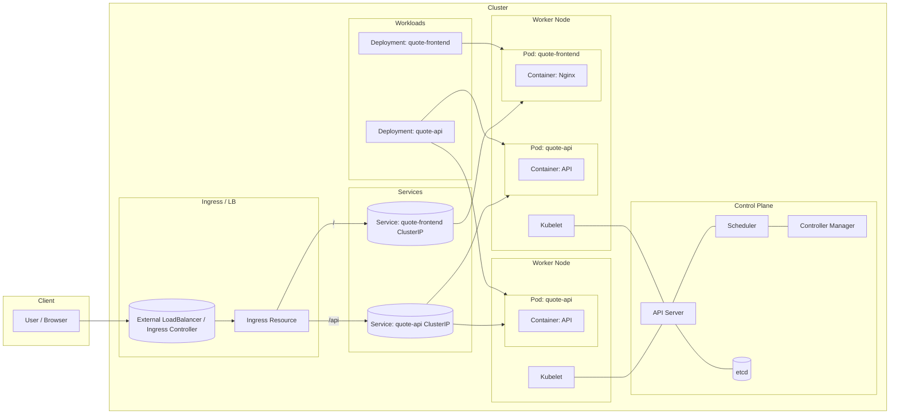

Big-picture Kubernetes: one-page mental model 

Here’s a single Mermaid diagram you can use as a backbone mental model for most day‑to‑day K8s work:

How to read this diagram (and remember the concepts) 

I’ll map each major concept to a “sticky” mental hook using the diagram.

1. Control plane: the brain and memory 

In the top of the cluster, you see API Server, Scheduler, Controller Manager, etcd.

- Think of this as: “brain + memory.”

- ‎`etcd` is the source of truth for cluster state (what should exist).

- The API server is the front door; every ‎`kubectl apply` is just “write desired state into etcd via the API.”

- Controllers (Deployment controller, ReplicaSet controller, etc.) constantly compare desired state vs actual state and fix drift.

From the diagram: arrows from ‎`API` to ‎`SCH`, ‎`CM`, and ‎`ETCD` reinforce this: everything goes through the API server.

Sticky summary: when you ‎`kubectl apply -f deployment.yaml`, you’re just updating a row in “Kubernetes’ database” (etcd). Controllers do the rest.

2. Nodes and Kubelet: the workers and their local foreman 

On the left and right we have Node1 and Node2, each with:

- A Kubelet (K1, K2) talking to the API server.

- One or more Pods (PodA, PodB, PodC).

Mental model:

- Node = machine (VM or physical).

- Kubelet = local foreman on that machine: “API server told me I should be running these pods; let me make sure Docker/containerd actually runs them.”

In the diagram, note the lines ‎`K1 --- API` and ‎`K2 --- API`: Kubelets don’t talk to each other; they all talk up to the control plane.

Sticky summary: control plane decides what should run and where; kubelets make it actually run on each node.

3. Pods: the unit of scheduling 

The rounded rectangles PodA, PodB, PodC each contain a container.

- Pod = “thing that gets scheduled”.

- A pod can have multiple containers, but they share:

 ▫ Network namespace (localhost)

 ▫ Volumes

- In your tutorials: ‎`quote-api` pod and ‎`quote-frontend` pod map directly to PodA / PodB / PodC.

On the diagram, pods hang off nodes because the scheduler assigns them to nodes. But you never talk to pods directly from the outside world in a real system.

Sticky summary: pod is the runtime sandbox where your containers live; pods are mortal and IPs change.

4. Deployments: the contract for “keep N pods alive” 

Look at the Workloads box:

- ‎`Deployment: quote-api` → owns PodA + PodC (two replicas).

- ‎`Deployment: quote-frontend` → owns PodB.

A Deployment is:

- A template for pods (same spec as a Pod plus metadata).

- A replica count (desired number of pods).

- Desired state: “I want 3 pods like this, rolling updates, rollback support.”

Controllers read this and reconcile: if a pod dies, create a new one; if you change the image tag, perform a rolling update.

Sticky summary: you rarely create pods directly; you create Deployments and let them continuously create/replace pods to match your intent.

5. Services: stable names and load balancing 

In the Services block you see:

- ‎`Service: quote-api ClusterIP`

- ‎`Service: quote-frontend ClusterIP`

These are:

- Stable IP + DNS name representing a logical group of pods selected by labels.

- Internal load balancers within the cluster.

In the diagram:

- ‎`SAPI` connects to both PodA and PodC → that’s the label selector: “all pods with ‎`app=quote, component=api`.”

- ‎`SFE` connects only to PodB (the frontend pod).

Important behavior:

- If PodA dies and a new PodD appears on another node, the Service automatically rewires endpoints.

- Clients (like the frontend) call ‎`http://quote-api` instead of chasing pod IPs.

Sticky summary: Service = “phone number + load balancer” for a group of pods. Pods come and go; the Service address stays stable.

6. Ingress + LoadBalancer: one front door, many rooms 

On the outer edge of the cluster is Ingress / LB:

- ‎`LB` is either:

 ▫ A cloud LoadBalancer (ELB, ALB, etc.), or

 ▫ A NodePort fronted by an Ingress controller.

- ‎`Ingress` is a routing table: “‎`/api` → ‎`quote-api` Service, ‎`/` → ‎`quote-frontend` Service.”

The diagram shows:

- User → LB → Ingress → Services

- Path-based routing: ‎`/api` → SAPI, ‎`/` → SFE.

This is what lets you:

- Have one external IP / DNS name.

- Route to many backend services based on host/path (e.g., ‎`api.example.com` vs ‎`www.example.com`, ‎`/api` vs ‎`/admin`).

Sticky summary: Ingress + controller = smart HTTP router sitting in front of internal Services.

7. Typical request path: walk the arrows 

The really sticky part is to mentally trace a request:

1. User hits ‎`https://quotes.example.com/api/random`.

2. DNS resolves to the external LB (‎`LB` in diagram).

3. LB sends to the Ingress controller pod.

4. Ingress (‎`ING`) rule: path ‎`/api` → backend Service ‎`quote-api`.

5. Service ‎`SAPI` picks one of its backing pods (PodA or PodC) and forwards the request.

6. Pod’s container (‎`C1` or ‎`C3`) processes the request and responds.

If you can see this path in your head, most debugging becomes: “where along this path is it broken?”

8. How this ties back to your hands-on tutorials 

Using the same diagram:

- Pods tutorial: you worked at the PodA/PodB level, plus probes and pod IPs.

- Deployments tutorial: you’ll be operating in the Workloads box (DEPAPI / DEPFE) and watching pods appear/disappear.

- Services tutorial: you’ll wire up SAPI and SFE and stop caring about pod IPs.

- Ingress tutorial: you’ll focus on LB + ING and path routing to the Services.

If you want, I can next redraw a smaller Mermaid diagram focused just on Pods ↔ Deployment ↔ Service for your “Quote API” and annotate that for day-to-day debugging.