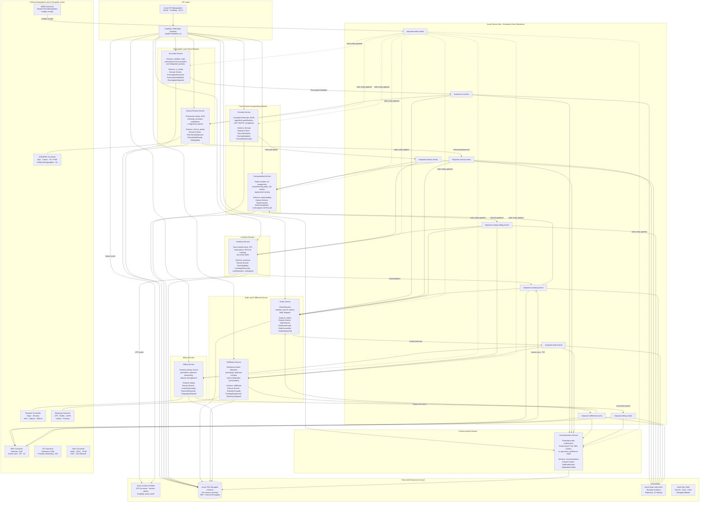
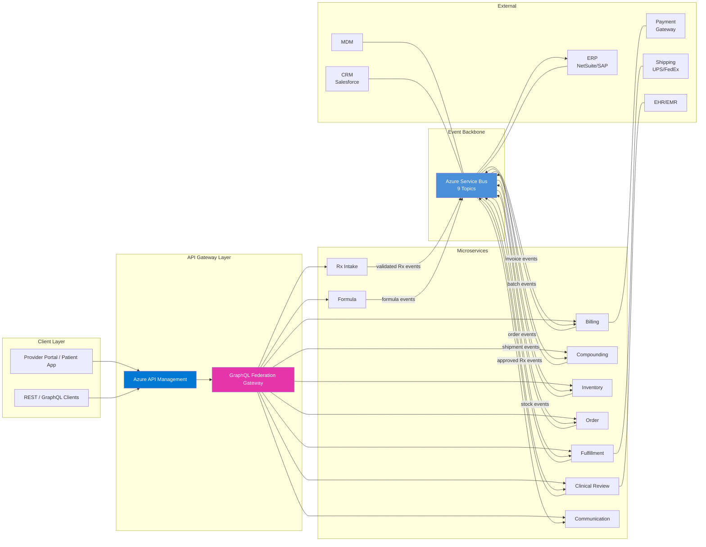

SoR/SoE stands for **System of Record / System of Engagement**.
A System of Record is the **authoritative source of truth** for a particular set of data
A System of Engagement is focused on **how users and external parties interact** with the system:

# Empower Pharmacy — Pharmacy Management System

**Enterprise Technology Group**

**Project Architecture Blueprint** — *Microservices Edition*

**Technology Stack:** Java Spring Boot · GraphQL Federation · Reactive Programming (Project Reactor) · Azure Service Bus · SQL Server · Azure Cloud Native

| | | |
|---|---|---|
| **Document Version** 1.0 | **Classification** Internal — Confidential | **Date** June 2026 |

---

## 1. Executive Summary

This blueprint defines the complete technical architecture for Empower Pharmacy's Pharmacy Management System (PMS) — a cloud-native, microservices-based platform built to modernize compounding pharmacy operations at enterprise scale. The architecture is derived from the Empower Marketplace Platform Component View (slide 14) and the Enterprise Architecture Logical View, both of which informed the domain decomposition, event topology, and integration patterns described herein.

### 1.1 Business Context

**Current Pain Points (as identified in Enterprise Architecture Review):**

- Fragmented systems across ordering, inventory, pharmacy, and finance with no unified event backbone
- Limited real-time visibility into operations — orders, batches, and inventory changes are not surfaced reactively
- Data inconsistencies across Provider, Product, and Order domains due to absence of a Master Data hub
- Tight coupling between subsystems, slowing down change velocity and making compliance audits expensive
- Increasing regulatory burden (HIPAA, FDA, USP 795/797/800, DEA, 503A/503B) requiring audit-grade traceability end-to-end

**Strategic Architecture Response:**

- **Event-Driven Architecture:** Azure Service Bus as the enterprise event backbone, decoupling all bounded contexts
- **API-First design** via GraphQL Federation Gateway — composable, schema-governed, backward-compatible
- **Reactive Non-Blocking I/O** throughout using Project Reactor (Spring WebFlux) for high-throughput prescription pipelines
- **Domain-Driven Design:** 9 bounded contexts, each a deployable Spring Boot microservice with its own SQL Server schema
- **Compliance by Design:** audit events, distributed tracing (Azure Monitor), Key Vault secrets, HIPAA-aligned data residency
- **MDM Centricity:** golden records for Provider, Product (Formula/SKU), and Patient maintained across all services

---

## 2. Architecture Principles

All design decisions in this blueprint are governed by the following six architectural principles, drawn directly from the Enterprise Architecture Logical View.

| Principle | Statement | Implementation Pattern |
|---|---|---|
| **Event-Driven** | Real-time sync, loose coupling between domains | Azure Service Bus topics/subscriptions; domain events as first-class contracts |
| **API-First** | Reusable, composable, schema-governed services | GraphQL Federation Gateway; subgraph-per-service; schema registry in Azure API Management |
| **System of Record vs. Engagement** | Clear separation of who owns which data | Each microservice owns its bounded context; no cross-service direct DB calls |
| **Compliance by Design** | Audit, e-Sign, data retention baked in | Azure Monitor + distributed tracing; immutable audit log table per service; Key Vault for PHI keys |
| **MDM Centric** | Trusted, governed master data across the enterprise | MDM Service as golden-record authority; all services reference MDM IDs, not local copies |
| **Batch & Lot Traceability** | End-to-end visibility from ingredient to patient | Lot number propagation via Service Bus; CompoundingWorkflow service correlates batch ↔ formula ↔ prescription |

---

## 3. System Context — C4 Level 1

The Pharmacy Management System sits at the center of Empower's Marketplace Platform, mediating between external actors (providers, patients, regulators) and internal backend systems (ERP, CRM, MDM, fulfillment, shipping).

### 3.1 External Actors

| Actor | Type | Interaction Channel | Data Exchanged |
|---|---|---|---|
| Provider (HCP / Clinic) | External Human | Provider Portal (Web) / Provider Exp Mobile App | Rx orders, patient context, formulary queries |
| Patient | External Human | Customer Support Portal / MarketPlace | Order status, shipment tracking, Rx history |
| External Integration Partners | External System | REST API / GraphQL (via API Gateway) | Rx intake feeds, lab results, refill automation |
| Shipping Carrier (UPS/FedEx) | External System | Fulfillment Service → Carrier API | Shipping labels, tracking numbers, delivery confirmation |
| Payment Gateway (Stripe/etc.) | External System | Billing Service → Payment Connector | Charge authorization, settlement, refunds |
| EHR / EMR Systems | External System | HL7 FHIR / SFTP Connector | Patient records, formulary updates, lab orders |

### 3.2 Internal Platform Systems

| System | Role | Integration Mode |
|---|---|---|
| ERP (NetSuite / SAP) | Financial transactions, procurement, inventory ledger, invoice generation | ERP Connector → Azure Service Bus; batch reconciliation jobs |
| CRM (Salesforce) | Lead capture, provider onboarding, opportunity tracking, customer 360 | SF Connector; MDM sync for Provider golden records |
| MDM (Master Data Management) | Golden records: Provider, Patient, Formula, Product/SKU, Vendor, Raw Material | Event-driven sync; all services resolve IDs via MDM APIs |
| Centralized AI Platform | LLM, Vector DB, RAG prompts for clinical decision support | Internal gRPC / REST; async inference results via Service Bus |
| Azure Service Bus | Enterprise event backbone — all domain events routed here | Native Spring AMQP / azure-servicebus SDK integration |

### 3.3 System Interaction Diagram

The following C4-style container diagram shows how external actors, internal platform systems, and the nine bounded-context microservices interact. Synchronous GraphQL calls flow left-to-right through the API gateway; domain events flow right-to-left through Azure Service Bus for state propagation.

```mermaid
flowchart TB
    subgraph ExternalActors["External Actors"]
        PROVIDER["Provider (HCP / Clinic)<br/>Submits Rx orders, queries formulary"]
        PATIENT["Patient<br/>Checks order status, Rx history"]
        PARTNER["Integration Partners<br/>Rx intake feeds, refill automation"]
        SHIPPING["Shipping Carrier (UPS/FedEx)<br/>Label gen, tracking, delivery conf."]
        PAYMENT["Payment Gateway (Stripe)<br/>Charge authorization, settlement"]
        EHR_SYS["EHR / EMR Systems<br/>Patient records, formulary, lab orders"]
    end

    subgraph InternalSystems["Internal Platform Systems"]
        ERP_SYS["ERP (NetSuite / SAP)<br/>Financial txns, procurement, GL"]
        CRM_SYS["CRM (Salesforce)<br/>Lead capture, provider onboarding"]
        MDM_SYS["MDM Platform<br/>Golden records: Provider, Patient, Product"]
        AI_SYS["Centralized AI Platform<br/>LLM, RAG for clinical decision support"]
    end

    subgraph APILayer["API and Gateway Layer"]
        APIM["Azure API Management<br/>OAuth, throttling, routing, mTLS"]
        GQL["GraphQL Federation Gateway<br/>Aggregates all 9 subgraphs into unified schema"]
    end

    subgraph MS["Bounded Contexts (Microservices)"]
        direction TB
        RX["Rx Intake Service<br/>Receives, validates, routes prescriptions"]
        CLIN["Clinical Review Service<br/>Pharmacist review, DUR, e-Signature"]
        FML["Formula Service<br/>Compound formulas, BOM, USP compliance"]
        COMP["Compounding Service<br/>Batch creation, mfg steps, QC checks"]
        INV["Inventory Service<br/>Stock mgmt, ATP, lot tracking"]
        ORD["Order Service<br/>Order lifecycle: place through dispatch"]
        FUL["Fulfillment Service<br/>Warehouse alloc, shipments, carrier API"]
        BILL["Billing Service<br/>Contract pricing, invoices, payments"]
        COMM["Communication Service<br/>Email, SMS, push notifications"]
    end

    subgraph Backbone["Event Backbone and Data"]
        SB["Azure Service Bus (9 Topics)<br/>Enterprise event backbone, pub/sub"]
        SQL[("Azure SQL Managed Instance<br/>Per-service schemas, TDE encrypted")]
        REDIS["Azure Cache for Redis<br/>ATP hot reads, session tokens, query cache"]
        DLAKE["Azure Data Lake<br/>Analytics, reporting, AI training"]
    end

    %% External to API Gateway
    PROVIDER -->|"HTTPS / GraphQL"| APIM
    PATIENT -->|"HTTPS / GraphQL"| APIM
    PARTNER -->|"REST API"| APIM
    EHR_SYS -->|"HL7 FHIR / SFTP"| APIM
    APIM --> GQL

    %% GraphQL Federation to Microservices
    GQL --> RX
    GQL --> CLIN
    GQL --> FML
    GQL --> COMP
    GQL --> INV
    GQL --> ORD
    GQL --> FUL
    GQL --> BILL
    GQL --> COMM

    %% Microservices to Service Bus (publish domain events)
    RX --> SB
    CLIN --> SB
    FML --> SB
    COMP --> SB
    INV --> SB
    ORD --> SB
    FUL --> SB
    BILL --> SB

    %% Service Bus to Subscribers
    SB --> CLIN
    SB --> COMP
    SB --> ORD
    SB --> INV
    SB --> FUL
    SB --> BILL
    SB --> COMM

    %% Internal Systems to Service Bus
    ERP_SYS -->|"Invoice sync, PO"| SB
    CRM_SYS -->|"Provider onboarding"| MDM_SYS
    MDM_SYS -->|"Golden record broadcasts"| SB
    AI_SYS -.->|"Inference results"| SB

    %% External integrations via connectors
    FUL ---|"Carrier API"| SHIPPING
    BILL ---|"Payment SDK"| PAYMENT
    CLIN ---|"Lab results"| EHR_SYS

    %% Infrastructure connections
    RX --> SQL
    CLIN --> SQL
    FML --> SQL
    COMP --> SQL
    INV --> SQL
    ORD --> SQL
    FUL --> SQL
    BILL --> SQL
    COMM --> SQL
    INV -->|"ATP cache"| REDIS
    GQL -->|"Query cache"| REDIS
    SB -->|"Event capture"| DLAKE

    %% Styling
    style ExternalActors fill:#F5F5F5,stroke:#666,stroke-dasharray: 5 5
    style InternalSystems fill:#E8F8F5,stroke:#27AE60,stroke-dasharray: 5 5
    style APILayer fill:#FEF9E7,stroke:#F39C12
    style MS fill:#EBF5FB,stroke:#2980B9
    style Backbone fill:#F4ECF7,stroke:#8E44AD
    style SB fill:#4A90D9,color:#fff
    style GQL fill:#E535AB,color:#fff
    style APIM fill:#0078D4,color:#fff
```



---

## 4. Bounded Contexts & Microservice Inventory

The PMS is decomposed into nine bounded contexts, each implemented as an independently deployable Spring Boot microservice. Each service owns its schema, publishes and consumes domain events, and exposes a GraphQL subgraph to the Federation Gateway.

| # | Bounded Context | Service Name | Core Responsibility | Key Domain Events Published |
|---|---|---|---|---|
| 1 | Rx Intake | rx-intake-service | Receive, validate, and route prescriptions from providers and integrations | PrescriptionReceived, PrescriptionValidated, PrescriptionRejected |
| 2 | Clinical Review | clinical-review-service | Pharmacist review, DUR checking, formulary compliance, e-Signature | PharmacistApproved, ClinicalHoldPlaced, RxModified |
| 3 | Formula Management | formula-service | Compound formulas, BOM, ingredient specifications, USP compliance | FormulaCreated, FormulaUpdated, FormulaDeprecated |
| 4 | Compounding Workflow | compounding-service | Batch creation, lot assignment, manufacturing steps, QC checks | BatchCreated, BatchCompleted, LotAssigned, QCPassed |
| 5 | Inventory Management | inventory-service | Raw material stock, ATP (available-to-promise), reservations, FIFO lot tracking | StockUpdated, InventoryReserved, LowStockAlert, LotExpired |
| 6 | Order Management | order-service | Order lifecycle: validate → submit → confirm → fulfill → dispatch | OrderPlaced, OrderConfirmed, OrderCancelled, OrderDispatched |
| 7 | Fulfillment | fulfillment-service | Warehouse batch allocation, packaging, shipment creation, carrier integration | ShipmentCreated, PackageDispatched, DeliveryConfirmed |
| 8 | Billing & Payments | billing-service | Charge calculation, contract pricing, invoice generation, payment processing | InvoiceGenerated, PaymentReceived, ChargebackRaised |
| 9 | Communication | communication-service | Patient/provider notifications — Email (SES), SMS (Twilio), in-app alerts | NotificationSent, NotificationFailed |

---

## Microservice Interaction & Responsibility Diagram



### Simplified Interaction Diagram



### 4.1 Rx Intake Service (rx-intake-service)

Responsible for receiving, validating, and routing prescription submissions from providers and external integration partners. Every inbound prescription passes schema validation, DEA schedule checks, and duplicate detection before being published as a domain event.

| Capability | Detail |
|---|---|
| Prescription Submission | Accepts Rx via REST POST; supports structured and attachment-based submissions |
| Schema Validation | Validates prescription structure, required fields, and DEA schedule compliance |
| Duplicate Detection | Checks for duplicate prescriptions within configurable time window |
| Rx Attachment Handling | Stores uploaded attachments (images, PDFs) in Azure Blob Storage |
| Status & History Queries | Provides real-time prescription status and full history for patient portals |
| Route Validated Rx | Publishes PrescriptionValidated events to empower.rx.events topic |

**REST Endpoints:**

| Method | Path | Description |
|---|---|---|
| POST | /api/v1/rx/submit | Submit a new prescription |
| GET | /api/v1/rx/{rxId} | Get prescription details and status |
| GET | /api/v1/rx/history/{patientId} | Get prescription history for a patient |
| POST | /api/v1/rx/validate | Validate a prescription without submitting |
| GET | /api/v1/rx/{rxId}/attachments | Get attachments for a prescription |

### 4.2 Clinical Review Service (clinical-review-service)

Manages the pharmacist review workflow: review queue assignment, drug utilization review (DUR), formulary compliance checking, e-Signature capture, and clinical hold management. Each review decision is recorded immutably for audit compliance.

| Capability | Detail |
|---|---|
| Review Queue Management | Maintains prioritized queue of prescriptions awaiting pharmacist review |
| DUR Checking | Performs drug-drug interaction, allergy, and duplicate therapy checks |
| Formulary Compliance | Validates prescribed drugs against active formulary and patient-specific plans |
| e-Signature Capture | Captures pharmacist e-Signature with tamper-evident audit record |
| Clinical Hold | Places and resolves clinical holds with reason codes and timestamps |
| State Rule Enforcement | Applies state-specific dispensing rules via configurable rule engine (Drools / SpEL) |

**REST Endpoints:**

| Method | Path | Description |
|---|---|---|
| GET | /api/v1/review/queue | Get the pharmacist review queue |
| GET | /api/v1/review/queue/{pharmacistId} | Get queue for a specific pharmacist |
| POST | /api/v1/review/approve | Approve a prescription (with e-Signature payload) |
| POST | /api/v1/review/hold | Place or update a clinical hold |
| POST | /api/v1/review/modify | Modify a prescription during clinical review |
| GET | /api/v1/review/{rxId}/history | Get full review history for a prescription |

### 4.3 Formula Service (formula-service)

Manages the master catalog of compound formulas including their bill of materials (BOM), ingredient specifications, USP compliance designations, and version-controlled lifecycle. Serves as the system of record for all formula data consumed by compounding and inventory services.

| Capability | Detail |
|---|---|
| Formula CRUD | Create, update, version, and deprecate compound formulas |
| BOM Management | Defines ingredients, quantities, units, and alternate suppliers per formula |
| Ingredient Specifications | Tracks ingredient monographs, USP grade, storage requirements |
| USP Compliance Flags | Designates USP 795 (non-sterile) vs USP 797 (sterile) vs USP 800 (hazardous) |
| Version Control | Immutable version history; each change creates a new formula version |
| 503A/503B Designation | Maintains office-use vs patient-specific compounding designation |

**REST Endpoints:**

| Method | Path | Description |
|---|---|---|
| GET | /api/v1/formulas | Search formulas with filters (name, status, USP class) |
| GET | /api/v1/formulas/{formulaId} | Get formula details and current version |
| GET | /api/v1/formulas/{formulaId}/bom | Get bill of materials for a formula |
| POST | /api/v1/formulas | Create a new formula |
| PUT | /api/v1/formulas/{formulaId} | Update formula (creates new version) |
| PUT | /api/v1/formulas/{formulaId}/deprecate | Deprecate a formula |
| GET | /api/v1/formulas/{formulaId}/versions | Get version history |

### 4.4 Compounding Service (compounding-service)

Orchestrates the compounding workflow from batch creation through manufacturing and QC. Creates batches from approved formulas, assigns lot numbers, tracks each manufacturing step, and records quality control results before marking batches as ready for fulfillment.

| Capability | Detail |
|---|---|
| Batch Creation | Creates compounding batches from approved formulas with lot assignment |
| Manufacturing Step Tracking | Records each production step with operator, timestamp, and parameters |
| QC Check Management | Submits and tracks QC results; enforces pass/fail gates |
| Equipment Usage | Records equipment assignments and cleaning verification per batch |
| Lot Traceability | Correlates batch number to formula, ingredients, and destination prescriptions |
| Environmental Monitoring | Records cleanroom conditions, garbing compliance (USP 797) |

**REST Endpoints:**

| Method | Path | Description |
|---|---|---|
| POST | /api/v1/batches | Create a new compounding batch |
| GET | /api/v1/batches/{batchId} | Get batch details and current status |
| GET | /api/v1/batches/trace/{lotNumber} | End-to-end trace by lot number |
| PUT | /api/v1/batches/{batchId}/steps | Record a manufacturing step |
| POST | /api/v1/batches/{batchId}/qc | Submit QC test results |
| GET | /api/v1/batches/{batchId}/qcrecords | Get QC history for a batch |
| PUT | /api/v1/batches/{batchId}/complete | Mark batch as completed |

### 4.5 Inventory Service (inventory-service)

Manages raw material inventory, available-to-promise (ATP) calculations, stock reservations, and FIFO lot tracking. The ATP endpoint is on the critical path for order placement and uses reactive non-blocking I/O via R2DBC and Redis caching to meet P99 \< 50ms latency targets.

| Capability | Detail |
|---|---|
| ATP Query | Checks available-to-promise for a SKU using real-time stock minus reservations |
| Stock Reservation | Reserves inventory against an order; releases on cancellation |
| FIFO Lot Tracking | Assigns lots in FIFO order; tracks expiry and enforces rotation |
| Low Stock Alerting | Publishes LowStockAlert when stock drops below configurable thresholds |
| Lot Expiry Management | Monitors approaching expiry dates; publishes LotExpired events |
| Stock Adjustments | Handles physical count adjustments, returns, and write-offs |

**REST Endpoints:**

| Method | Path | Description |
|---|---|---|
| GET | /api/v1/inventory/atp/{sku} | Check available-to-promise for a SKU |
| GET | /api/v1/inventory/items | List inventory items with filters (category, stock level) |
| GET | /api/v1/inventory/lots/{lotId} | Get lot record details |
| GET | /api/v1/inventory/movements | Query stock movement history with date range |
| POST | /api/v1/inventory/reserve | Reserve inventory against an order |
| POST | /api/v1/inventory/release | Release previously reserved inventory |
| POST | /api/v1/inventory/adjust | Adjust stock levels (physical count, return, write-off) |
| GET | /api/v1/inventory/expiring | Get lots nearing expiry within configurable window |

### 4.6 Order Service (order-service)

Manages the full order lifecycle from placement through fulfillment and dispatch. Orchestrates the Choreography Saga for order placement — coordinating with inventory reservation, pharmacy approval, and batch creation via Service Bus events.

| Capability | Detail |
|---|---|
| Order Placement | Creates orders from validated prescriptions with line-item decomposition |
| Order Lifecycle | Manages state machine: placed → confirmed → fulfilled → dispatched |
| Inventory Coordination | Triggers ATP check and reservation via Service Bus event |
| Order Cancellation | Handles cancellation with compensating inventory release |
| Status Tracking | Maintains full order status history with timestamps per state transition |
| Provider Portal Queries | Supports real-time order status and history for Provider Portal |

**REST Endpoints:**

| Method | Path | Description |
|---|---|---|
| POST | /api/v1/orders | Place a new order |
| GET | /api/v1/orders/{orderId} | Get order details and line items |
| GET | /api/v1/orders/history/{customerId} | Get order history for a customer |
| PUT | /api/v1/orders/{orderId}/cancel | Cancel an order (triggers compensation saga) |
| GET | /api/v1/orders/{orderId}/status | Get current order status |
| GET | /api/v1/orders/{orderId}/timeline | Get full order state transition timeline |

### 4.7 Fulfillment Service (fulfillment-service)

Handles post-compounding logistics: warehouse batch allocation, packaging instructions, shipment creation, and carrier API integration.

| Capability | Detail |
|---|---|
| Consume Order Events | Subscribes to order.confirmed; triggers fulfillment workflow |
| Warehouse Batch Allocation | Assigns compounded batches to shipment boxes; applies packaging rules |
| Batch-vs-Shipment Mapping | Links lot numbers to shipment IDs for full traceability |
| Call Carrier API | Integrates with UPS, FedEx, USPS via Shipping Carrier adapter |
| Order Dispatch Carrier Integration | Updates carrier tracking details; publishes shipment.created event |
| Publish Events | shipment.created, package.dispatched, delivery.confirmed |

**REST Endpoints:**

| Method | Path | Description |
|---|---|---|
| POST | /api/v1/fulfillment/shipments | Create a shipment from allocated batches |
| GET | /api/v1/fulfillment/shipments/{shipmentId} | Get shipment details and contents |
| GET | /api/v1/fulfillment/shipments/{shipmentId}/tracking | Get carrier tracking information |
| PUT | /api/v1/fulfillment/shipments/{shipmentId}/dispatch | Mark shipment as dispatched |
| GET | /api/v1/fulfillment/shipments/by-order/{orderId} | List all shipments for an order |

### 4.8 Billing Service (billing-service)

Implements contract-aware pricing, invoice generation, and payment lifecycle. Integrates with the Pricing Engine (contract pricing, tier pricing, channel-accounting pricing) and ERP financial modules.

| Capability | Detail |
|---|---|
| Contract Pricing | Applies negotiated rates from contract stored in Pricing Engine; supports tier and channel-accounting pricing |
| Invoice Generation | Creates invoices upon order dispatch; batches daily summaries to ERP |
| Payment Processing | Integrates with Payment Gateway (Stripe/Revenio); handles capture, void, and refund flows |
| ERP Financial Sync | Publishes invoice.generated events consumed by ERP Connector for GL posting |
| Dispute Management | Tracks chargeback cases; supports manual override with audit trail |

**REST Endpoints:**

| Method | Path | Description |
|---|---|---|
| GET | /api/v1/billing/invoices/{orderId} | Get invoice for a specific order |
| GET | /api/v1/billing/invoices/{invoiceId}/details | Get full invoice details and line items |
| POST | /api/v1/billing/payments/process | Process a payment for an invoice |
| POST | /api/v1/billing/payments/refund | Process a refund |
| GET | /api/v1/billing/contracts/{providerId} | Get contract pricing rates for a provider |
| GET | /api/v1/billing/invoices | List invoices with status and date range filters |

### 4.9 Communication Service (communication-service)

Delivers all patient and provider notifications. Subscribes to domain events from upstream services and routes messages via the appropriate channel — Email (Azure Communication Services), SMS (Twilio / NICE), or in-app push.

| Capability | Detail |
|---|---|
| Consume Order Events | Subscribes to order.dispatched, shipment.created for shipping notifications |
| Consume User Events | Subscribes to provider.onboarded (welcome email), rx.clinical.hold (alert to provider) |
| Send Email | Templated transactional email via Azure Communication Services |
| Send SMS | SMS via Twilio integration; fallback to NICE |
| Welcome Email on Sign-up | Triggered by CRM onboarding event; personalized provider welcome |
| Preference Management | Stores per-patient/provider notification preferences; opt-out compliance |

**REST Endpoints:**

| Method | Path | Description |
|---|---|---|
| GET | /api/v1/communication/notifications/{userId} | Get notification history for a user |
| GET | /api/v1/communication/preferences/{userId} | Get notification preferences for a user |
| PUT | /api/v1/communication/preferences | Update notification preferences |
| POST | /api/v1/communication/send | Send a one-off notification (admin/testing) |

---

## 5. API Gateway & GraphQL Federation Layer

The Marketplace Platform Component View shows the API Gateway and Orchestration Layer at the top of the architecture. In this implementation, this layer comprises Azure API Management (APIM) as the gateway and a GraphQL Federation Gateway aggregating subgraphs from all microservices.

### 5.1 Azure API Management (APIM)

| APIM Capability | Configuration |
|---|---|
| Routing | Policy-based routing to downstream microservice or GraphQL Gateway |
| Authentication | OAuth 2.0 / JWT validation against Azure AD B2C; API key for partner integrations |
| Throttling | Rate limiting per subscription tier (Provider Portal: 1000 RPM, Integration API: 5000 RPM) |
| Versioning | URL-based versioning (/v1/, /v2/) with deprecation policy |
| Security | mTLS for service-to-service; OWASP policy set applied globally |
| Rate Binding | Per-IP and per-subscription throttle policies; burst allowances configurable |

### 5.2 GraphQL Federation Gateway

Each microservice exposes a GraphQL subgraph using Spring for GraphQL. The Federation Gateway (Apollo Federation v2 compatible, implemented via Netflix DGS or Spring GraphQL Federation) stitches all subgraphs into a single unified schema.

| Subgraph | Key Entity Types Exposed | Key Queries / Mutations |
|---|---|---|
| rx-intake-subgraph | Prescription, RxLineItem, RxAttachment | submitPrescription, prescriptionStatus, rxHistory |
| clinical-review-subgraph | ReviewDecision, ClinicalHold, PharmacistSignature | reviewQueue, approveRx, placeHold |
| formula-subgraph | Formula, FormulaVersion, BomLine, IngredientSpec | formulaSearch, formulaBom, createFormula |
| compounding-subgraph | Batch, BatchStep, QcRecord, LotAssignment | batchTrace, createBatch, submitQc |
| inventory-subgraph | InventoryItem, LotRecord, ATPSnapshot | availableToPromise, lotDetails, stockMovements |
| order-subgraph | Order, OrderLineItem, OrderStatus | placeOrder, orderHistory, cancelOrder |
| fulfillment-subgraph | Shipment, PackageDetail, CarrierTracking | shipmentStatus, dispatchPackage |
| billing-subgraph | Invoice, PaymentRecord, ContractRate | invoiceHistory, processPayment |
| communication-subgraph | NotificationLog, NotificationPreference | notificationHistory, updatePreferences |

### 5.3 Reactive API Patterns

| Pattern | Use Case | Implementation |
|---|---|---|
| Server-Sent Events (SSE) | Real-time pharmacist review queue updates | Spring WebFlux + Flux\<ServerSentEvent\>; clinical-review-service |
| GraphQL Subscriptions | Live order status on Provider Portal | GraphQL WS protocol over WebSocket; order-service publishes via Reactor |
| Reactive REST (Mono/Flux) | High-throughput Rx intake (\> 500 concurrent) | Spring WebFlux controllers returning Mono\<Rx\> or Flux\<Rx\> |
| Reactive DB Access | Non-blocking SQL queries in inventory ATP path | R2DBC (Reactive Relational Database Connectivity) with SQL Server driver |
| Backpressure | Protect downstream during traffic spikes | Project Reactor request(n) signals; bounded queues on Service Bus consumers |

---

## 6. Event-Driven Architecture — Azure Service Bus Topology

Azure Service Bus is the enterprise event backbone. All inter-service communication for state changes flows via Service Bus topics (pub/sub) or queues (point-to-point). No service calls another service's REST API for state propagation — only for synchronous read queries.

### 6.1 Topic & Subscription Design

| Service Bus Topic | Publisher | Subscribers | Message Schema |
|---|---|---|---|
| empower.rx.events | rx-intake-service | clinical-review-service, order-service, communication-service | PrescriptionEvent { rxId, type, payload, correlationId, timestamp } |
| empower.clinical.events | clinical-review-service | compounding-service, order-service, communication-service | ClinicalEvent { rxId, decisionType, pharmacistId, esigRef } |
| empower.formula.events | formula-service | compounding-service, inventory-service, compliance-vault | FormulaEvent { formulaId, version, changeType, bomSnapshot } |
| empower.compounding.events | compounding-service | inventory-service, order-service, fulfillment-service | BatchEvent { batchId, lotNumbers, formulaId, rxIds, status } |
| empower.inventory.events | inventory-service | compounding-service, order-service, erp-connector | InventoryEvent { skuId, lotId, qty, movementType, atp } |
| empower.order.events | order-service | fulfillment-service, billing-service, communication-service | OrderEvent { orderId, status, lineItems, customerId } |
| empower.fulfillment.events | fulfillment-service | order-service, communication-service, erp-connector | FulfillmentEvent { shipmentId, orderId, carrierRef, trackingNumber } |
| empower.billing.events | billing-service | erp-connector, communication-service | BillingEvent { invoiceId, orderId, amount, paymentStatus } |
| empower.mdm.events | mdm-service | All services (broadcast) | MdmEvent { entityType, entityId, changeType, goldenRecord } |

### 6.2 Event Schema Standards

**Standard Event Envelope (all Service Bus messages):**

- **eventId:** UUID — globally unique, used for idempotency deduplication
- **eventType:** reverse-domain string (e.g., com.empower.rx.validated)
- **version:** semantic version of the event schema (e.g., 1.0.0)
- **correlationId:** traces a business transaction (Rx → Batch → Shipment) across all hops
- **causationId:** eventId of the event that caused this event (parent-child trace)
- **timestamp:** ISO-8601 UTC
- **source:** service name + instance ID
- **payload:** service-specific JSON object; schema validated against JSON Schema registry

### 6.3 Saga Patterns — Distributed Transactions

Where multi-service consistency is required (e.g., submitting an order atomically across inventory reservation, pharmacy approval, and payment), the Choreography Saga pattern is used. Each service responds to events and publishes compensating events on failure.

| Saga | Steps (Choreography) | Compensation on Failure |
|---|---|---|
| Order Placement Saga | 1. OrderPlaced → 2. InventoryReserved → 3. RxApproved → 4. BatchCreated → 5. OrderConfirmed | OrderCancelled → InventoryReleased → BatchAborted |
| Batch Compounding Saga | 1. BatchCreated → 2. IngredientsConsumed → 3. ManufacturingCompleted → 4. QCPassed → 5. BatchReady | BatchFailed → IngredientsReturned → RxRerouted |
| Shipment Dispatch Saga | 1. OrderConfirmed → 2. ShipmentCreated → 3. CarrierLabelGenerated → 4. PackageDispatched → 5. OrderDispatched | ShipmentFailed → FulfillmentRetried → CustomerNotified |

---

## 7. Data Architecture

### 7.1 Database-per-Service Pattern

Each microservice owns a dedicated SQL Server schema (logical schema isolation; shared Azure SQL Managed Instance per environment for cost efficiency in non-prod; dedicated instances per service in production for performance isolation and compliance boundary enforcement).

| Service | SQL Server Schema | Critical Tables | Estimated Row Volume/Year |
|---|---|---|---|
| rx-intake-service | rx_intake | rx_intakes, rx_line_items, rx_attachments, rx_audit_log | ~5M prescriptions |
| clinical-review-service | clinical_review | review_queue, review_decisions, esignature_records, dur_results | ~5M decisions |
| formula-service | formula | formulas, formula_versions, bom_lines, ingredient_specs, compliance_flags | ~50K formulas |
| compounding-service | compounding | batches, batch_steps, qc_records, lot_assignments, equipment_usage | ~2M batches |
| inventory-service | inventory | inventory_items, lot_records, stock_movements, reservations, atp_snapshots | ~20M movements |
| order-service | orders | orders, order_line_items, order_status_history, compliance_flags | ~6M orders |
| fulfillment-service | fulfillment | shipments, packages, carrier_events, dispatch_log | ~6M shipments |
| billing-service | billing | invoices, invoice_lines, payments, chargebacks, contract_rates | ~6M invoices |
| communication-service | communications | notification_log, notification_preferences, delivery_receipts | ~30M notifications |

### 7.2 Data Lake & Analytics

| Layer | Technology | Purpose |
|---|---|---|
| Transactional Data Store | Azure SQL Managed Instance (SQL Server) | OLTP; per-service schemas; HIPAA-encrypted at rest (TDE) |
| Data Lake | Azure Data Lake Storage Gen2 + Synapse Analytics | Reporting, analytics, AI training datasets; domain events land here via Event Hub capture |
| Reporting / Power BI | Azure Synapse SQL Pools + Power BI Premium | Operations dashboards: order volume, batch yield, inventory turns, compliance KPIs |
| MDM Golden Store | Azure SQL (dedicated) | Master Data Management golden records for Provider, Patient, Formula, Product, Vendor |
| AI / Vector Store | Azure Cosmos DB for Mongo API + Azure AI Search | Embeddings for clinical decision support RAG; formula recommendation engine |
| Cache Layer | Azure Cache for Redis | ATP hot reads (inventory), session tokens, GraphQL query results (short TTL) |

### 7.3 Data Ownership Matrix

| Domain Entity | System of Record | Replicated To | Sync Mechanism |
|---|---|---|---|
| Prescription (Rx) | rx-intake-service | clinical-review, order-service (read model) | Service Bus events; CQRS read models |
| Formula / BOM | formula-service | compounding-service, inventory-service | formula.updated events |
| Inventory / ATP | inventory-service | order-service (ATP check cache) | inventory.stock.updated + Redis TTL |
| Order | order-service | fulfillment-service, billing-service | order.confirmed event |
| Batch / Lot | compounding-service | inventory-service, fulfillment-service | batch.completed + lot.assigned events |
| Provider (Golden) | MDM Service (CRM feed) | rx-intake, order-service, billing-service | mdm.entity.updated broadcast |
| Patient (Golden) | MDM Service (EHR feed) | rx-intake, communication-service | mdm.entity.updated broadcast |
| SKU / Product | MDM / Catalog Service | inventory-service, order-service, pricing-engine | mdm.entity.updated; catalog.updated |
| Invoice / Payment | billing-service | ERP (GL), communication-service | billing.invoice.generated event |

---

## 8. Cross-Cutting Concerns

### 8.1 Security & Identity

| Concern | Implementation |
|---|---|
| Authentication | Azure AD B2C for Provider/Patient portals; Azure AD for internal services; OAuth 2.0 + PKCE |
| Authorization | Spring Security + custom @PreAuthorize annotations; RBAC roles: PHARMACIST, PROVIDER, ADMIN, COMPLIANCE_OFFICER |
| Secrets Management | Azure Key Vault for DB connection strings, API keys, TDE encryption keys; Spring Cloud Azure Key Vault Secrets |
| PHI Encryption at Rest | Azure SQL TDE + column-level encryption for SSN, DOB, medication details |
| PHI in Transit | TLS 1.3 everywhere; mTLS between microservices in AKS; Azure Private Link for SQL |
| Audit Logging | Every PHI access logged to immutable audit_log table; forwarded to Azure Monitor + Log Analytics |
| Vulnerability Scanning | OWASP policy in APIM; Dependabot on all Spring Boot services; Azure Defender for Containers |

### 8.2 Observability & Monitoring

| Pillar | Tooling | Key Metrics / Signals |
|---|---|---|
| Distributed Tracing | Azure Monitor Application Insights + OpenTelemetry SDK | Trace: Rx intake → clinical review → batch → shipment latency |
| Metrics | Micrometer → Azure Monitor / Prometheus | Service latency P50/P95/P99, error rate, Service Bus queue depth, ATP cache hit rate |
| Logging | Logback JSON → Azure Log Analytics Workspace | Structured logs with correlationId, rxId, batchId; HIPAA-safe (no PHI in logs) |
| Alerting | Azure Monitor Alert Rules | PagerDuty integration: queue depth \> 1000, error rate \> 1%, ATP service \> 100ms P99 |
| Dashboards | Azure Monitor Workbooks + Power BI | Ops: active Rx queue, batch in progress, inventory health; Compliance: audit completion rate |
| Health Checks | Spring Boot Actuator /health; Azure AKS liveness/readiness probes | Liveness: JVM alive; Readiness: DB connected, Service Bus reachable, Redis connected |

### 8.3 Compliance & Regulatory

**Regulatory Coverage by Architecture Component:**

- **HIPAA:** PHI encrypted at rest (TDE + column encryption) and in transit (TLS 1.3 + mTLS); access audit log per 45 CFR §164.312; minimum necessary access via RBAC
- **USP 795 (Non-sterile Compounding):** Formula Service tracks ingredient specs, BOM, beyond-use dating; QC records in Compounding Service
- **USP 797 (Sterile Compounding):** Batch Service records environmental monitoring data, cleanroom assignments, garbing compliance flags
- **USP 800 (Hazardous Drugs):** Inventory Service flags NIOSH hazardous drug SKUs; Compounding Service enforces HD handling workflow steps
- **DEA 21 CFR Part 1300 (Controlled Substances):** Rx Intake validates DEA schedule; Clinical Review enforces hard-stop pharmacist approval; Batch Service records biennial inventory counts
- **FDA 503A / 503B:** Formula Service maintains office-use vs patient-specific designation; Compounding Service enforces production volume limits
- **State Board Compliance:** Clinical Review Service applies state-specific dispensing rules via configurable rule engine (Drools / Spring Expression Language)

---

## 9. Integration Layer — External Connectors

The Integration Layer connects the PMS to external systems identified in the Enterprise Architecture Logical View: ERP, CRM (Salesforce), MDM, EHR/EMR, Payment Gateway, and Shipping Carrier. Each connector follows the Anti-Corruption Layer (ACL) + Adapter pattern.

| Connector | Connects To | Protocol | Key Responsibilities |
|---|---|---|---|
| erp-connector | ERP (NetSuite / SAP) | REST API + Batch SFTP | Invoice sync to GL; procurement PO acknowledgement; inventory financial valuation; batch reconciliation |
| sf-connector (CRM) | Salesforce | Salesforce REST API / Event Bus | Provider lead → onboarded sync; opportunity → order linkage; account 360 update |
| mdm-connector | MDM Platform | REST API + Service Bus | Golden record resolution for Provider, Patient, Product; publishes mdm.entity.updated events |
| ehr-emr-connector | EHR/EMR (Epic, Cerner) | HL7 FHIR R4 / SFTP | Patient demographics; Rx intake from ePrescribing; lab result feed |
| payment-connector | Payment Gateway (Stripe / Revenio) | Stripe SDK / REST | Charge authorization, capture, void, refund; webhook receipt for async payment events |
| shipping-connector | Shipping Carrier (UPS, FedEx, USPS) | Carrier REST API | Label generation; tracking number registration; delivery confirmation webhook |
| nice-twilio-connector | NICE (voice), Twilio (SMS) | REST API | Outbound SMS notifications; IVR call routing for patient order inquiries |
| okta-connector | Okta (external IdP) | SAML / OIDC | SSO for provider portal logins; SCIM provisioning for user lifecycle |

---

## 10. Infrastructure & Cloud Deployment

### 10.1 Azure Cloud Architecture

| Azure Service | Usage in PMS |
|---|---|
| Azure Kubernetes Service (AKS) | All 9 microservices deployed as Kubernetes Deployments; horizontal pod autoscaling on CPU and Service Bus queue depth |
| Azure API Management (APIM) | GraphQL Gateway ingress; REST API gateway; OAuth enforcement; throttle policies; developer portal |
| Azure Service Bus Premium | Enterprise event backbone; 10 topics; dead-letter queue per topic; 7-day message retention; geo-redundancy |
| Azure SQL Managed Instance | Per-service SQL Server schemas; Always Encrypted for PHI columns; TDE; automated backups; Business Critical tier for prod |
| Azure Cache for Redis | ATP hot reads; GraphQL query cache; session tokens; distributed lock for idempotency checks |
| Azure Key Vault | DB credentials; API keys; TDE keys; certificate management; managed identity access |
| Azure Monitor + App Insights | Distributed tracing; metrics; log analytics workspace; alert rules; dashboards |
| Azure Container Registry (ACR) | Docker image repository for all microservice images; vulnerability scanning integration |
| Azure DevOps | CI/CD pipelines; Terraform for IaC; branch policies; automated test gates; release approvals |
| Azure Private Link / VNet | All inter-service and DB traffic on private VNet; no public internet egress for data plane |
| Azure Communication Services | Transactional email (replacing SES dependency); SMS backup channel |

### 10.2 CI/CD Pipeline (Azure DevOps)

**Pipeline Stages per Microservice:**

- **Stage 1 — Build:** mvn clean package -DskipTests; Docker build + push to ACR; SCA scan (Snyk)
- **Stage 2 — Unit & Integration Test:** JUnit 5 + Mockito unit tests; Spring Boot Test integration tests; Testcontainers for SQL Server
- **Stage 3 — Contract Test:** Spring Cloud Contract (consumer-driven); Service Bus event schema validation against JSON Schema registry
- **Stage 4 — Deploy to Dev:** Helm chart deploy to dev AKS namespace; smoke test via health endpoints
- **Stage 5 — QA Gate:** Automated API regression (Karate DSL); performance test (Gatling: 500 RPS, P99 \< 200ms); manual approval gate
- **Stage 6 — Deploy to Staging:** Blue-green deployment; canary traffic at 10%; synthetic monitoring
- **Stage 7 — Production Release:** Manual release approval; blue-green cutover; Service Bus partition auto-scaling validation; rollback plan

### 10.3 Environment Strategy

| Environment | Purpose | SQL Server Tier | AKS Node Pool | Notes |
|---|---|---|---|---|
| Development | Individual feature development | Standard (shared MI) | 2x Standard_D4s_v3 | Shared instance; schema-per-service; truncation allowed |
| QA / Integration | Cross-service integration testing | Standard (shared MI) | 3x Standard_D4s_v3 | Full Service Bus topology; realistic test data sets |
| Staging | Pre-production validation; performance testing | Business Critical (shared MI) | 4x Standard_D8s_v3 | Production-like; anonymized production data; canary deployments |
| Production | Live patient/provider traffic | Business Critical (dedicated MI per service) | 6x Standard_D8s_v3 + autoscale | Multi-AZ; geo-redundant Service Bus; 30-day audit retention |

---

## 11. Key Operational Flows

### 11.1 Prescription Intake to Pharmacist Approval

```
Provider Submits Rx           Rx Intake Validates           rx.validated        Clinical Review          Pharmacist Approves
(REST POST /rx/submit)        (Schema + DEA schedule)      (Service Bus)        Enqueues for Pharmacist  (e-Signature captured)

         ↓                           ↓                           ↓                     ↓                         ↓

rx.approved                    Order Service                Inventory Reserved    order.confirmed          Compounding
(Service Bus)                  Creates Order                (ATP check → reserve) (Service Bus)             Batch Created
```

### 11.2 Compounding Batch to Shipment

```
Batch Created                 Steps Recorded               QC Submitted          batch.completed          Fulfillment
(Formula + Lot assigned)      (Each mfg step)              (Results logged)      (Service Bus)            Allocates Warehouse

         ↓                           ↓                           ↓                     ↓                         ↓

Shipment Created              Carrier Label                Package Dispatched    shipment.dispatched      Patient SMS/Email
(Box + packaging)             Generated (API call)         (Scan event)          (Service Bus)            (Communication Svc)
```

### 11.3 Real-time ATP Check (Reactive Path)

The ATP check is on the critical path for order placement. Target: P99 \< 50ms. Implementation uses reactive non-blocking I/O throughout:

**ATP Request Flow:**

Provider Portal → GraphQL Query (availableToPromise) → Federation Gateway → inventory-subgraph resolver → inventory-service REST (WebFlux Mono\<ATPResponse\>) → Redis ATP cache (TTL: 30s) **HIT:** return immediately (\< 5ms) | **MISS:** compute ATP from stock_movements via SQL Server R2DBC (non-blocking).

Reactive flatMap chain: Mono\<StockRecord\> → Mono\<ReservationSummary\> → Mono\<ATPResponse\>. Write-through cache update on stock.updated events (Service Bus consumer updates Redis asynchronously). Result streamed back via GraphQL WebSocket subscription for live order screens.

---

## 12. Architectural Decision Records (ADRs)

| ADR # | Decision | Rationale | Trade-offs Accepted |
|---|---|---|---|
| ADR-001 | GraphQL Federation over REST aggregation | Provider Portal needs single-query access across Rx, Order, and Inventory domains; Federation avoids client-side joins | Added gateway complexity; requires schema discipline across teams |
| ADR-002 | Choreography Saga over Orchestration | Avoids central orchestrator SPOF; services remain autonomous; matches event-driven principle | More complex failure reasoning; requires idempotent consumers |
| ADR-003 | R2DBC for inventory ATP path only | ATP is highest-frequency, latency-sensitive read; other services can use JPA without reactive overhead | R2DBC ecosystem less mature; limited to SQL Server 2019+ driver |
| ADR-004 | Azure Service Bus Premium (not Kafka) | Native Azure integration; lower operational burden; adequate throughput for pharmacy volume; built-in geo-redundancy | Lower max throughput than Kafka (sufficient for \< 10K events/sec per topic) |
| ADR-005 | Database-per-service (SQL Server schemas) | Enforces bounded context isolation; enables independent scaling; satisfies HIPAA audit boundary | No cross-service joins; eventual consistency for read models required |
| ADR-006 | Spring for GraphQL (not Netflix DGS) | Spring ecosystem alignment; official Spring project; first-class WebFlux support | Less community content than DGS; newer project |
| ADR-007 | Helm + AKS over Azure Container Apps | Greater control over networking (Private Link), autoscaling triggers (Service Bus queue depth), and pod-level HIPAA configuration | Higher K8s operational overhead; requires AKS expertise on team |

---

## 13. Blueprint Maintenance & Evolution

**Recommended Update Triggers:**

- **New microservice added or bounded context split:** update Section 4 (Service Inventory) and Section 6 (Event Topology)
- **New Azure Service Bus topic or event type:** update Section 6.1 (Topic Design) and relevant service detail page
- **Regulatory change (new USP chapter, DEA rule):** update Section 8.3 (Compliance) and relevant service data architecture
- **New external integration (new EHR, payment provider):** add to Section 9 (Integration Layer)
- **Technology upgrade (Spring Boot major version, AKS version):** update Section 10 and create an ADR
- **Performance SLA change:** update Section 11.3 (ATP flow) and Section 10.2 (pipeline gate criteria)

---

*This document was generated: June 2026. Architecture owner: Principal Software Engineer, Empower Pharmacy Enterprise Technology Group. Review cycle: Quarterly or on significant architectural event.*