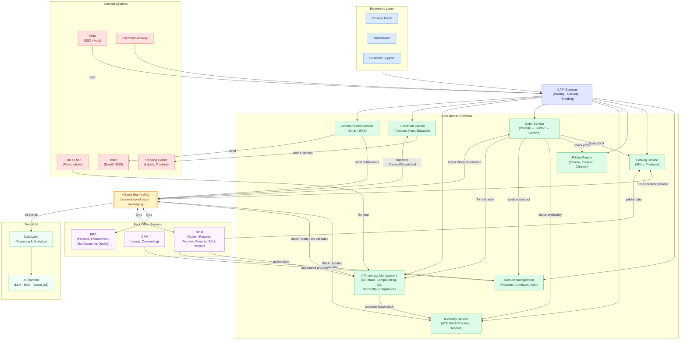

#### Plain English Summary
Empower Pharmacy is building a **marketplace platform** for compounded medications, connecting healthcare providers with pharmacy operations and end customers. The architecture reveals two levels of detail: the **logical view** shows the big-picture layers, and the **component view** shows exactly how each service behaves at runtime.
Below is a service-by-service documentation of every business requirement visible in both diagrams.

---

### 1. Pharmacy Management Service
This is the operational heart of the system — where the actual compounding pharmacy work happens.
#### What it needs to do:
**Prescription Handling**
- Accept and intake new prescriptions from providers
- Handle prescription variations (e.g. strength changes, formulation adjustments requested by the prescriber)
- Route prescriptions to a licensed pharmacist for review before any compounding begins
**Compounding & Manufacturing**
- Manage batch manufacturing — producing multiple units of a formulation in one production run
- Handle formulation management — storing and versioning the exact recipe (ingredients, strengths, mixing steps) for each compound
- Integrate with the EHR/EMR system so patient records and prescriptions are pulled in automatically
- Integrate with eRx (electronic prescribing) and EMS systems so prescriptions arrive digitally
**Compliance & Traceability**
- Track lot and batch traceability — every batch must be traceable end-to-end per FDA 503A/503B requirements
- Run dispense authorization checks — a pharmacist must explicitly authorize before a compound ships
- Manage recall management — if a batch is recalled, the system must be able to identify every order that used it
- Handle quality management — document QC steps, deviations, and sign-offs
**Event Publishing**
- Publish events (e.g. "batch ready", "prescription validated") so downstream services like fulfillment and communication are notified automatically
```
- **EHR**: Electronic Health Record  
    This is a comprehensive, longitudinal digital record of a patient’s health information that is designed to be shared across organizations (hospitals, clinics, labs, specialists). It supports interoperability and care coordination.
- **EMR**: Electronic Medical Record  
    This is the digital version of the chart in a single clinician’s or organization’s office. It typically stays within one practice and is focused on that provider’s view of the patient’s care.
- **EMS**: Emergency Medical Services  
    This refers to pre-hospital emergency care and transport systems (like ambulances, paramedics, 911 medical response), not a patient record.
```
---
### 2. Inventory Service
Manages the physical stock of raw materials, finished compounds, and their availability.
#### What it needs to do:
- Track product consumption — deduct from inventory as orders are fulfilled
- Maintain real-time available-to-purchase (ATP) counts so the marketplace never oversells
- Support batch-level tracking — inventory isn't just counted in units, it's tracked by which batch it came from (critical for recalls)
- Expose a Get ATP API so the Order Service can check availability before confirming an order
- Reserve inventory when an order is placed (soft lock), releasing it if the order is cancelled
- Publish events (e.g. "stock updated") so the ERP and other services stay in sync
---
### 3. Pricing Engine
Determines what price a provider or customer sees for any given product.
#### What it needs to do:
- Consume sku-level events — react when a new product SKU is created or changed
- Consume contract pricing — apply negotiated rates for specific providers or clinics
- Consume product/SKU events to keep pricing aligned with catalog changes
- Apply multiple pricing strategies:
    - Volume-based pricing (bigger order = lower unit price)
    - Tax pricing
    - Channel-based pricing (marketplace price vs. direct B2B price may differ)
    - Custom/non-standard accounting pricing for specific contracts
- Expose a Get Pricing API so the Order Service can retrieve the correct price at checkout
- Publish events when prices change so downstream systems can react

---
### 4. Catalog / Listing Service
Manages the product catalog — what's available for order on the marketplace.
#### What it needs to do:
- Allow SKU creation — adding new compounded formulations to the catalog
- Capture rich product attributes: title, description, dosage, strength, packaging, shelf life, shelf type, channel eligibility
- Expose a Get Products API so the marketplace frontend can display products
- Publish events when catalog items are created or changed (so pricing, inventory, and ERP are notified)
---
### 5. Order Service
The transaction layer — orchestrates the full lifecycle of a customer order.
#### What it needs to do:
- Validate the SKU being ordered (is it a real, active product?)
- Validate the price (does what the customer is paying match what the pricing engine says?)
- Check availability against the Inventory Service before confirming
- Validate the contract (does this provider have an active agreement that covers this order?)
- Submit the order once all checks pass
- Run compliance validation — for compounded medications, this likely includes checking the prescription is valid before the order can proceed
- Trigger a prescription validation workflow (interfaces with the Prescription Validation Identifier / 503A module) for regulated compounds
- Reserve inventory once the order is confirmed
- Publish order events (Order Placed, Order Confirmed) consumed by fulfillment, ERP, and communications
---
### 6. Account Management Service
Manages provider (clinic/hospital/HCP) accounts and their relationship with Empower.
#### What it needs to do:
- Authenticate tokens — validate that the calling party (provider portal or API) is who they say they are
- Handle org creation — onboard a new clinic or provider organization into the system
- Manage contracts — store and enforce the pricing/service agreement between Empower and the provider
- Associate orders with the correct customer/provider account
- Send welcome emails to users when they sign up
- Publish events as accounts are created or updated
---
### 7. Fulfillment Service
Takes a confirmed order and turns it into a physical shipment.
#### What it needs to do:
- Consume order events — listen for "Order Confirmed" before beginning fulfillment
- Handle shipment creation — generate a shipment record with all relevant details
- Manage warehouse operations: batch allocation (assigning the right batch to an order) and packaging
- Calculate batch-vs-shipment mapping — knowing which batch fulfills which shipment (traceability requirement)
- Call a Carrier API to book shipping with third-party carriers
- Handle order dispatch and carrier integration updates
- Publish events (Shipment Created, Shipment Dispatched) to downstream services
- Support multi-region fulfillment (the diagram shows Southeast/Southwest/Northeast/Northwest routing nodes)
---
### 8. Shipping Carrier Integration
The interface between Empower's fulfillment operations and external shipping companies.
#### What it needs to do:
- Generate shipping labels
- Return tracking numbers back to the fulfillment system
- Confirm package dispatch so the order can be marked shipped
---
### 9. Communication Service
Handles all outbound notifications to customers and providers.
#### What it needs to do:
- Consume order events — triggered when orders are placed, confirmed, shipped, or dispatched
- Consume user events — triggered by account creation or profile changes
- Send emails (transactional: order confirmations, shipping notifications, welcome messages)
- Send SMS notifications for real-time order status updates
- The service is the single channel for all customer-facing communication, keeping notification logic out of individual services
---
### 10. ERP Integration (via ERP Connector)
Connects Empower's operational platform to the back-office financial and manufacturing ERP.
#### What it needs to do:
- Sync batch production data — when a manufacturing batch is completed, ERP knows about it
- Handle financial posting — revenue recognition, cost accounting entries
- Manage procurement flows — raw material purchase orders and invoices
- Update stock in the ERP's inventory ledger to match operational inventory
- Validate orders in ERP before confirming (the diagram shows Order Validated → Creates Official Order → Invoice Posted flow)
- Generate invoices once an order is confirmed and fulfilled
The ERP houses: Procurement, Finance (GL, AR, AP), Inventory (stock ledger), Manufacturing (formulations, batch production), Quality (eBR, audit, deviations), and Compliance (regulatory, audit, e-sign).
---
### 11. CRM Integration
Manages the sales and onboarding pipeline for new provider relationships.
#### What it needs to do:
- Capture leads — HCPs, clinics, hospitals expressing interest in Empower
- Convert leads to opportunities through a qualification process
- Manage provider onboarding — the formal process of bringing a new prescriber or clinic onto the platform

---
### 12. MDM (Master Data Management)
The single source of truth for all core reference data across the enterprise.
#### What it needs to do:
- Manage Practice/Customer master data: Provider, Patient, Clinic, Hospital records
- Manage Formula master data: Bill of Materials (BOM), compounding instructions, raw material requirements
- Manage Raw Material data: ingredients, grades, strength, dosage, specs, units
- Manage Product (SKU) data: BOM, attributes, packaging specs, status lifecycle
- Manage Vendor data: supplier profiles, approved sites, certifications

MDM is the "golden record" layer — all other services consume from it to avoid data inconsistencies across domains.

---
### 13. Identity Provider (IdP / AuthN)
Handles authentication and user identity.
#### What it needs to do:
- Create user identity records
- Assign roles (provider, pharmacist, admin, customer, etc.)
- Manage user organization membership
- Feed into the Account Management Service during onboarding
---
### 14. Cross-Cutting Platform Requirements
These apply across all services:

| Concern                          | Requirement                                                                 |
| -------------------------------- | --------------------------------------------------------------------------- |
| **Compliance**                   | HIPAA, FDA 503A/503B traceability built into every transaction              |
| **Identity & Access Management** | Role-based access control across all services                               |
| **Centralized Logging**          | All service activity logged to a central store                              |
| **Monitoring & Alerts**          | Real-time health monitoring with alerting                                   |
| **Distributed Tracing**          | End-to-end request tracing across services                                  |
| **Key Vault**                    | Secrets and credentials managed centrally, never in application code        |
| **Event Bus (Kafka)**            | All inter-service communication is event-driven, not direct API calls       |
| **Anti-Corruption Layer**        | Adapters between Empower's domain model and external systems (ERP, MDM, SF) |

---
### 15. AI Platform (Emerging Requirement)
The logical view shows a **Centralized AI Platform** at the base of the architecture with:
- LLM integration
- Vector DB (for semantic search/retrieval)
- RAG (Retrieval-Augmented Generation)
- Prompt management1974
- 
This suggests upcoming requirements around AI-assisted pharmacist review, intelligent order routing, or provider-facing search — not yet wired into the component view but architecturally planned.

---

### Key Architectural Principles (as stated in the logical view)

1. **Event-Driven** — services communicate via events, not direct calls. This means no tight coupling; a pricing change doesn't require the order service to be redeployed.
2. **API-First** — every capability is exposed as a reusable API (the API Gateway sits in front of everything).
3. **System of Record vs. System of Engagement** — the ERP and MDM are systems of record; the marketplace and portals are systems of engagement. They must stay in sync but serve different purposes.
4. **Compliance by Design** — audit trails, e-signatures, and data retention are built into the platform, not bolted on.
5. **MDM Centric** — master data is trusted and governed at the MDM layer; no service maintains its own copy of provider or formula data.
6. **Batch & Lot Traceability** — every unit shipped can be traced back to its raw material lot. This is a hard FDA requirement for 503B compounders.

## Mermaid diagram



1. **Providers & customers** enter through the Experience Layer (portal, marketplace, support)
2. Everything passes through the **API Gateway** for routing and security (Okta handles auth here)
3. The **Order Service** is the central orchestrator — it calls Catalog, Pricing, Inventory, and Account Management to validate before confirming
4. A confirmed order triggers **Pharmacy Management** to compound and **Fulfillment** to ship
5. Every service publishes events to the **Kafka Event Bus** — this is what keeps everything loosely coupled and in sync
6. **ERP and MDM** stay in sync via Kafka — MDM pushes golden records (formulas, SKUs, provider data) back to the core services
7. All events flow into the **Data Lake**, which feeds the AI Platform
8. **External systems** (EHR for prescriptions, Twilio for comms, Shipping Carrier for labels) plug in at the edges