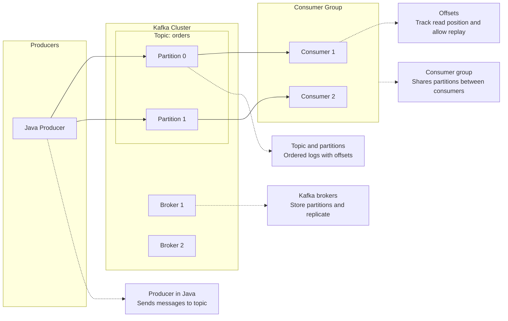

##### **Topics & Partitions** 
==**Topics** are named channels (or categories) that organize messages in Kafka.== Think of a topic as a logical feed — e.g., `order-events`, `health-recommendations`, `fee-billing-records`.
==**Partitions** are how Kafka splits a topic into parallel lanes for throughput and ordering.==
**How it works** 
A topic like `order-events` might have 12 partitions. When a producer sends a message, Kafka uses a **partition key** (e.g., `userId` or `orderId`) to deterministically route it to a specific partition. All messages with the same key land in the same partition, which guarantees **ordering per key**.

**Example from your experience** 
In your **Safeway personalization platform** processing 10 TB of health data for 1.8M users, imagine a topic called `user-health-profiles`:

```
Topic: user-health-profiles  (6 partitions)

Partition 0:  user-1001 → profile update, user-1001 → purchase event, user-1007 → ...
Partition 1:  user-1002 → profile update, user-1002 → widget config change, ...
Partition 2:  user-1003 → ...
...
```

- **Partition key =** `userId` ensures all events for a given user are processed in order (critical when composing homepage widgets from health profiles + purchase history).
- **6 partitions** means up to 6 consumer instances can read in parallel from one consumer group — scaling throughput horizontally.
- ==If you need more throughput, you increase partitions (but you can never decrease them).==

**Key tradeoff:** More partitions = more parallelism, but also more overhead (file handles, rebalancing time). And ordering is only guaranteed _within_ a partition, not across them.
##### **At-Least-Once vs. Exactly-Once Semantics** 
These describe **delivery guarantees** — what happens when failures occur.
###### **At-Least-Once** 
The producer retries on failure, so every message is delivered **at least once** — but duplicates are possible.
**Example from your JPMorgan Fee Billing platform (44M records/month, $1.6B revenue):**
```
Producer sends: FeeRecord-7829 → Kafka
Kafka ACK is lost due to network blip
Producer retries: FeeRecord-7829 → Kafka (again)

Result: FeeRecord-7829 now exists TWICE in the topic
```

This is why your resume mentions **idempotent batch processing** — your consumer must handle duplicates gracefully. A common pattern:
```java
// Idempotent consumer — checks before processing
if (!processedRecords.contains(record.getId())) {
    processFee(record);
    processedRecords.add(record.getId());  // mark as done
    consumer.commitOffset();
}
```
If the consumer crashes _after_ processing but _before_ committing the offset, Kafka will redeliver that record on restart. Without idempotency, you’d bill someone twice — catastrophic in a $1.6B revenue system.
###### **Exactly-Once Semantics (EOS)** 
The system guarantees each message is processed **exactly once** — no duplicates, no loss. Kafka achieves this by combining three mechanisms:
1. **Idempotent producer** (`enable.idempotence=true`) — Kafka deduplicates retries using a producer ID + sequence number.
2. **Transactions** — the producer wraps “read input + write output + commit offset” in a single atomic transaction.
3. `read_committed` **consumers** — consumers only see messages from committed transactions.

```
    BEGIN TRANSACTION
      1. Read FeeRecord-7829 from input-topic
      2. Compute fee → write result to output-topic
      3. Commit consumer offset for input-topic
    COMMIT TRANSACTION
```

If any step fails, the entire transaction rolls back. No partial state.
**The practical tradeoff:** EOS adds latency and reduces throughput (due to transaction coordination). Most systems — including what you’ve built — use **at-least-once + idempotent consumers**, which is simpler and faster. Exactly-once is worth it when correctness is non-negotiable and the performance cost is acceptable (e.g., financial ledger entries).
##### **Schema Evolution** 
==Schema evolution is about changing the structure of your messages (adding fields, removing fields, changing types) **without breaking existing producers and consumers**.==

**Why it matters** 
In a distributed system, you can’t upgrade every service simultaneously. When your Safeway personalization platform sends a `UserHealthProfile` event, the producer and multiple consumers may be deployed at different times. You need old consumers to keep working when the schema changes.

**How it works (with Avro + Schema Registry)** 
Kafka messages are typically serialized using **Avro**, **Protobuf**, or **JSON Schema**, with a **Schema Registry** that enforces compatibility rules.

**Example:** Your `UserHealthProfile` schema evolves over time:

```
// Version 1 (original)
{
  "userId": "string",
  "healthScore": "int",
  "purchaseHistory": ["string"]
}

// Version 2 — BACKWARD COMPATIBLE (added field with default)
{
  "userId": "string",
  "healthScore": "int",
  "purchaseHistory": ["string"],
  "dietaryPreferences": ["string"]   // NEW — default: []
}

// Version 3 — BREAKING CHANGE (renamed field — don't do this)
{
  "userId": "string",
  "wellnessScore": "int",   // was "healthScore" — old consumers break!
  "purchaseHistory": ["string"],
  "dietaryPreferences": ["string"]
}
```
**Compatibility modes** 

| Mode         | Rule                         | Use case                            |
| ------------ | ---------------------------- | ----------------------------------- |
| **BACKWARD** | New schema can read old data | Safe to upgrade consumers first     |
| **FORWARD**  | Old schema can read new data | Safe to upgrade producers first     |
| **FULL**     | Both directions work         | Safest — the default recommendation |
**Safe evolution patterns** 
- **Add a field** with a default value → always safe
- **Remove a field** that had a default → safe under forward compatibility
- **Rename a field** → breaking, avoid it
- **Change a field type** (int → string) → breaking, avoid it

**Connection to your experience** 
Your resume mentions **Protobuf.NET** at RealPage, where you replaced legacy serialization formats. Protobuf has schema evolution built in — fields are identified by number, not name, so you can add new fields (with new numbers) without breaking existing consumers. This is the same principle at work in Kafka schema evolution.

**Quick summary table** 

|Concept|One-liner|Your resume connection|
|---|---|---|
|**Topics/Partitions**|Topics organize messages; partitions parallelize them with per-key ordering|Safeway: partitioning by userId for 1.8M users|
|**At-Least-Once**|Messages may be delivered more than once; consumers must be idempotent|JPMorgan: idempotent batch processing for 44M records/month|
|**Exactly-Once**|Atomic transactions ensure no duplicates or loss; higher latency cost|Financial systems where double-billing is unacceptable|
|**Schema Evolution**|Changing message structure without breaking existing services|RealPage: Protobuf.NET migration; Safeway: evolving health profile events|

---------


Kafka is a distributed log where producers append messages and consumers read them in order; Java is the “native” client.
I’ll keep this at a clear, fundamentals level and tie each idea to Java code so it sticks.
**Core Kafka concepts (in plain language)** 
At a high level, Kafka is:
- **A distributed commit log**: messages are written once, append‑only, and kept for some retention period.
- **Organized into topics**: a topic is like a named stream, e.g. `orders`, `payments`.
- **Sharded by partitions**: each topic has multiple partitions; each partition is an ordered log of messages.
- **Accessed by producers and consumers**:
- **Producer**: sends messages to a topic (Kafka decides or you choose the partition).
- **Consumer**: reads messages from topic partitions, in order inside each partition.
- **Scalable and fault tolerant**: partitions are spread across Kafka brokers, with replication.
Important properties:
- Messages have an **offset** in each partition: a monotonically increasing index.
- Kafka is **pull‑based**: consumers pull data at their own pace.
- Messages are **not deleted immediately after consumption**; they stay until retention rules (time/size) delete them.

**Java + Kafka: the main APIs** 
With Java, you mostly work with three standard clients from `org.apache.kafka`:
1. `KafkaProducer<K, V>` – send messages.
2. `KafkaConsumer<K, V>` – read messages.
3. **(Optional) Admin client** – create topics, etc.

**1. Producing messages in Java** 
Key ideas:
- You configure a producer with:
- `bootstrap.servers` – where your Kafka cluster is.
- serializers for key and value, e.g. `StringSerializer`.
- You send **ProducerRecord** objects to a topic.

Minimal producer example:
```java
// File: SimpleProducer.java
import org.apache.kafka.clients.producer.KafkaProducer;
import org.apache.kafka.clients.producer.ProducerRecord;
import org.apache.kafka.clients.producer.RecordMetadata;
import org.apache.kafka.clients.producer.ProducerConfig;
import org.apache.kafka.common.serialization.StringSerializer;

import java.util.Properties;
import java.util.concurrent.Future;

public class SimpleProducer {

    public static void main(String[] args) throws Exception {
        Properties props = new Properties();
        props.put(ProducerConfig.BOOTSTRAP_SERVERS_CONFIG, "localhost:9092");
        props.put(ProducerConfig.KEY_SERIALIZER_CLASS_CONFIG, StringSerializer.class.getName());
        props.put(ProducerConfig.VALUE_SERIALIZER_CLASS_CONFIG, StringSerializer.class.getName());

        try (KafkaProducer<String, String> producer = new KafkaProducer<>(props)) {
            String topic = "demo-topic";

            for (int i = 0; i < 5; i++) {
                String key = "key-" + i;      // optional
                String value = "message-" + i;

                ProducerRecord<String, String> record =
                        new ProducerRecord<>(topic, key, value);

                Future<RecordMetadata> future = producer.send(record);
                RecordMetadata metadata = future.get(); // block just for demo

                System.out.printf(
                        "Sent to topic=%s partition=%d offset=%d value=%s%n",
                        metadata.topic(), metadata.partition(), metadata.offset(), value
                );
            }
        }
    }
}
```
Conceptually:
- **Topic**: `demo-topic`.
- **Partition**: chosen based on key (or round‑robin if no key).
- **Offset**: where the message landed; Kafka guarantees order per partition.
**2. Consuming messages in Java** 
Key ideas:
- Consumers belong to a **consumer group** (via `group.id`).
- Kafka assigns partitions to consumers in the same group; each partition is consumed by one group member.
- Offsets track how far a group has read.
Minimal consumer example:
```java
// File: SimpleConsumer.java
import org.apache.kafka.clients.consumer.ConsumerConfig;
import org.apache.kafka.clients.consumer.ConsumerRecords;
import org.apache.kafka.clients.consumer.ConsumerRecord;
import org.apache.kafka.clients.consumer.KafkaConsumer;
import org.apache.kafka.common.serialization.StringDeserializer;

import java.time.Duration;
import java.util.Collections;
import java.util.Properties;

public class SimpleConsumer {

    public static void main(String[] args) {
        Properties props = new Properties();
        props.put(ConsumerConfig.BOOTSTRAP_SERVERS_CONFIG, "localhost:9092");
        props.put(ConsumerConfig.KEY_DESERIALIZER_CLASS_CONFIG, StringDeserializer.class.getName());
        props.put(ConsumerConfig.VALUE_DESERIALIZER_CLASS_CONFIG, StringDeserializer.class.getName());
        props.put(ConsumerConfig.GROUP_ID_CONFIG, "demo-consumer-group");
        props.put(ConsumerConfig.AUTO_OFFSET_RESET_CONFIG, "earliest"); // start from beginning if no offset
        props.put(ConsumerConfig.ENABLE_AUTO_COMMIT_CONFIG, "true");    // auto commit offsets

        try (KafkaConsumer<String, String> consumer = new KafkaConsumer<>(props)) {
            consumer.subscribe(Collections.singletonList("demo-topic"));

            while (true) {
                ConsumerRecords<String, String> records =
                        consumer.poll(Duration.ofMillis(1000));

                for (ConsumerRecord<String, String> record : records) {
                    System.out.printf(
                            "Consumed from topic=%s partition=%d offset=%d key=%s value=%s%n",
                            record.topic(), record.partition(), record.offset(),
                            record.key(), record.value()
                    );
                }
            }
        }
    }
}
```
Conceptually:
- **Consumer group**: `demo-consumer-group` is treated as a single logical subscriber.
- Kafka tracks offsets **per group per partition**.
- If you scale out by running multiple instances with the same group ID, Kafka balances partitions across them.
**Offsets and consumer groups (fundamental to “how Kafka works”)** 
A few key mental models:
- **Offset = position in the log**.  
    Consumers can seek to any offset (e.g., replay from the beginning).
- **Consumer group = subscription**.  
    All consumers with the same `group.id` share the work of reading a topic; each message is delivered to exactly one consumer in the group.
- **Multiple groups = fan‑out**.  
    If you have groups `analytics-group` and `billing-group`, each group gets its own copy of the stream; they track offsets independently.
- **Offset commit**:
- Auto commit: Kafka client periodically commits “I’ve processed up to offset X”.
- Manual commit: you control exactly when to commit to avoid losing/duplicating on failure.
**Partitions, keys, and ordering** 
Kafka’s ordering guarantee is **within a partition**, not across the whole topic.
- If you send messages with the same **key**, Kafka uses a partitioner so that all messages with that key go to the **same partition**.
- That gives you **per‑key ordering**.
Example in the producer:
```java
ProducerRecord<String, String> record =
        new ProducerRecord<>("orders", "order-123", "created");
```
All events for `"order-123"` will go to the same partition, so a consumer will see `created -> paid -> shipped` in order for that order ID.
**Basic local setup mental model** 
When you’re just learning:
- Run Kafka locally (e.g. with Docker).
- Create a topic `demo-topic` with a few partitions.
- Run the producer above, watch offsets and partitions.
- Run one consumer group, then a second group with a different `group.id`, see both receive the same messages.
This maps the **abstract concepts** to the **Java classes**:
- **Log / topic / partition** → `topic` name and partition metadata.
- **Producer** → `KafkaProducer` + `ProducerRecord`.
- **Consumer group / offset** → `KafkaConsumer` configs + subscriptions + committed offsets.

**How this plugs into a Java/Spring architecture** 
Since you’re working with Spring Boot already for auth:
- In a typical microservice:
- One Spring Boot service acts as **producer** (e.g. writes `order-events`).
- Another acts as **consumer** of those events.
- With Spring Kafka you wrap `KafkaProducer` / `KafkaConsumer` in higher-level abstractions (`KafkaTemplate`, `@KafkaListener`), but the fundamentals above don’t change: topics, partitions, offsets, groups.
If you want, next step could be: same fundamentals but rewritten using Spring Boot + Spring Kafka (`KafkaTemplate`, `@KafkaListener`) instead of raw Java clients.


**How this ties back to the Kafka + Java fundamentals** 
Reading this diagram with the concepts:
- **P1 – Java Producer**  
    Your Java code uses `KafkaProducer` and `ProducerRecord` to send messages to a **topic** (`orders`). The producer can set a key so all messages for the same key (e.g., an order ID) go to the same **partition**.
- **KafkaCluster with B1/B2 and Topic: orders**  
    The Kafka cluster is a set of brokers. The topic `orders` is broken into **partitions** (`Partition 0`, `Partition 1`). Each partition is an **ordered log** of records with **offsets** (positions).
- **Consumers subgraph (Consumer Group)**  
    `Consumer 1` and `Consumer 2` are Java `KafkaConsumer` instances with the same `group.id`. Kafka assigns partitions so that each partition is consumed by **only one consumer in the group** at a time. That’s how Kafka scales reads horizontally.
- **N1–N5 notes**
- **N1**: Java producer sends messages into the topic.
- **N2**: Brokers store partitions and replicate them.
- **N3**: Topic/partitions are ordered logs with offsets.
- **N4**: Consumer group shares work; partitions are divided among consumers.
- **N5**: Offsets track how far each group has read and allow replay from earlier positions.
This gives you a clean, working visual of “Java producer → Kafka topic/partitions → Java consumer group, coordinated by offsets” without fighting Mermaid’s parser anymore.

===========================================

For Kafka with Java, you mainly configure two things: the producer client and the consumer client. I’ll show you the typical properties and what they mean.

**Producer configuration (Java)** 
Fundamentally you create a `Properties` object and pass it to `KafkaProducer`. The key configs are:

```java
// SimpleProducerConfig.java
import org.apache.kafka.clients.producer.ProducerConfig;
import org.apache.kafka.common.serialization.StringSerializer;
import java.util.Properties;
public class SimpleProducerConfig {
    public static Properties createProducerConfig() {
        Properties props = new Properties();
        // 1. How to reach Kafka
        props.put(ProducerConfig.BOOTSTRAP_SERVERS_CONFIG, "localhost:9092");
        // 2. How to serialize key and value
        props.put(ProducerConfig.KEY_SERIALIZER_CLASS_CONFIG, StringSerializer.class.getName());
        props.put(ProducerConfig.VALUE_SERIALIZER_CLASS_CONFIG, StringSerializer.class.getName());
        // 3. Delivery guarantees / reliability
        props.put(ProducerConfig.ACKS_CONFIG, "all");          // strongest guarantee (wait for all replicas)
        props.put(ProducerConfig.RETRIES_CONFIG, 3);           // retry transient failures
        props.put(ProducerConfig.MAX_IN_FLIGHT_REQUESTS_PER_CONNECTION, 5);
        // 4. Performance tuning (optional)
        props.put(ProducerConfig.LINGER_MS_CONFIG, 5);         // small delay to batch records
        props.put(ProducerConfig.BATCH_SIZE_CONFIG, 32_768);   // batch size in bytes (32KB)
        return props;
    }
}
```
Then you use it like:
```java
// ProducerApp.java
import org.apache.kafka.clients.producer.KafkaProducer;
import org.apache.kafka.clients.producer.ProducerRecord;
public class ProducerApp {
    public static void main(String[] args) {
        Properties props = SimpleProducerConfig.createProducerConfig();
        try (KafkaProducer<String, String> producer = new KafkaProducer<>(props)) {
            ProducerRecord<String, String> record =
                    new ProducerRecord<>("orders", "order-123", "created");
            producer.send(record); // usually async
            producer.flush();
        }
    }
}
```
Conceptually:
- `bootstrap.servers`: where your brokers live.
- `key.serializer` / `value.serializer`: how Java objects become bytes (String, JSON, etc.).
- `acks`, `retries`, `linger.ms`, `batch.size`: trade‑off between durability and throughput.
If you move to Spring Boot, these become `spring.kafka.producer.*` properties in `application.yml`, but it’s the same idea.
**Consumer configuration (Java)** 
Similarly, you build a `Properties` object and pass it to `KafkaConsumer`. The key configs are:
```java
// SimpleConsumerConfig.java
import org.apache.kafka.clients.consumer.ConsumerConfig;
import org.apache.kafka.common.serialization.StringDeserializer;
import java.util.Properties;
public class SimpleConsumerConfig {
    public static Properties createConsumerConfig() {
        Properties props = new Properties();
        // 1. How to reach Kafka
        props.put(ConsumerConfig.BOOTSTRAP_SERVERS_CONFIG, "localhost:9092");
        // 2. How to deserialize key and value
        props.put(ConsumerConfig.KEY_DESERIALIZER_CLASS_CONFIG, StringDeserializer.class.getName());
        props.put(ConsumerConfig.VALUE_DESERIALIZER_CLASS_CONFIG, StringDeserializer.class.getName());
        // 3. Consumer group and offset behavior
        props.put(ConsumerConfig.GROUP_ID_CONFIG, "orders-service"); // consumer group id
        props.put(ConsumerConfig.AUTO_OFFSET_RESET_CONFIG, "earliest");
        // earliest: start from beginning if no committed offset
        // latest: start from new messages only
        // 4. Offset commit strategy
        props.put(ConsumerConfig.ENABLE_AUTO_COMMIT_CONFIG, "true");
        // or false if you want manual commits
        // 5. Poll behavior (optional tuning)
        props.put(ConsumerConfig.MAX_POLL_RECORDS_CONFIG, 100);
        return props;
    }
}
```
And the usage:
```java
// ConsumerApp.java
import org.apache.kafka.clients.consumer.ConsumerRecord;
import org.apache.kafka.clients.consumer.ConsumerRecords;
import org.apache.kafka.clients.consumer.KafkaConsumer;
import java.time.Duration;
import java.util.Collections;
import java.util.Properties;
public class ConsumerApp {
    public static void main(String[] args) {
        Properties props = SimpleConsumerConfig.createConsumerConfig();
        try (KafkaConsumer<String, String> consumer = new KafkaConsumer<>(props)) {
            consumer.subscribe(Collections.singletonList("orders"));
            while (true) {
                ConsumerRecords<String, String> records =
                        consumer.poll(Duration.ofMillis(1000));
                for (ConsumerRecord<String, String> record : records) {
                    System.out.printf(
                            "topic=%s partition=%d offset=%d key=%s value=%s%n",
                            record.topic(), record.partition(), record.offset(),
                            record.key(), record.value()
                    );
                }

                // if ENABLE_AUTO_COMMIT_CONFIG=false, you would call:
                // consumer.commitSync();
            }
        }
    }
}
```

Conceptually:
- `bootstrap.servers`: same as producer.
- `group.id`: defines the **logical subscriber**; multiple instances with same group share partitions.
- `auto.offset.reset`: what to do if the group has no committed offset (first run, or retention expired).
- `enable.auto.commit`: whether the client automatically commits offsets, or you do it manually after processing.
**Spring Boot view (very briefly)** 
If you wire this into a Spring Boot app with Spring Kafka, the configuration just moves into `application.yml` or `application.properties`:

```yaml
spring:
  kafka:
    bootstrap-servers: localhost:9092
    consumer:
      group-id: orders-service
      auto-offset-reset: earliest
      key-deserializer: org.apache.kafka.common.serialization.StringDeserializer
      value-deserializer: org.apache.kafka.common.serialization.StringDeserializer
    producer:
      key-serializer: org.apache.kafka.common.serialization.StringSerializer
      value-serializer: org.apache.kafka.common.serialization.StringSerializer
```
Then you use `KafkaTemplate` for producers and `@KafkaListener` for consumers, but under the hood it’s the same producer/consumer configs we just walked through.
So at a fundamentals level: producer config is about how to reach Kafka, serialize, and tune reliability/perf; consumer config is about how to reach Kafka, deserialize, and control group behavior and offset commits.