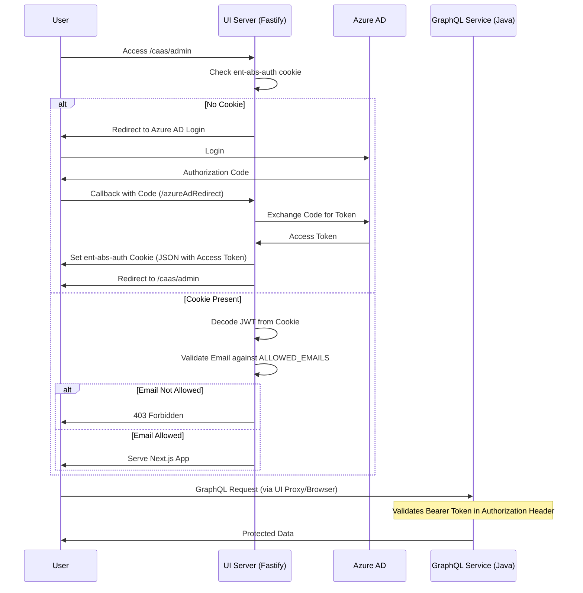

# rxwa-caas-ui-admin

This application is secured using Azure AD (MSAL) for authentication and authorization.

## Security Architecture

### Authentication (Azure AD / MSAL)

The application uses `@albertsons-authn/abs-node-authn` (a wrapper around MSAL for Node.js) to manage the authentication flow.

  

- **Client ID & Authority**: Configured via environment variables (`MSAL_CLIENT_ID`, `MSAL_AUTHORITY`).

- **Redirect URI**: `/caas/admin/azureAdRedirect` handles the callback from Azure AD.

- **Login Flow**: When an unauthenticated user accesses the app, they are redirected to Azure AD for login. Upon successful login, the `msalExchangeCodeForToken` method handles the token exchange and sets the authentication cookie.

  

### Cookie Handling

The application uses a secure cookie to maintain the session state.

  

- **Cookie Name**: `ent-abs-auth` (defined as `MSAL_COOKIE_NAME`).

- **Structure**: The cookie stores a JSON string containing the MSAL authentication results, including the `accessToken`.

- **Decoding**: The server-side middleware extracts this cookie and decodes the JWT `accessToken` using the `jsonwebtoken` library.

- **Identity Extraction**: The `email` or `upn` (User Principal Name) is extracted from the decoded JWT payload to identify the user.

  

### Authorization

Authorization is enforced at the middleware level in `src/server/middleware/nextAppWithAuth.ts`.

  

- **Allowed Emails**: A list of authorized users is maintained via the `ALLOWED_EMAILS` environment variable (comma-separated).

- **Validation**: For every request, the middleware:

1. Checks if the `ent-abs-auth` cookie is present and valid.

2. Extracts the user's email from the token.

3. Validates the email against the `ALLOWED_EMAILS` list.

- **Access Control**: If the user is not in the allowed list, they receive a `403 Forbidden` response. If they are not authenticated, they are redirected to the login flow.

  

### Authentication & Authorization Flow

  

  

## Deployment environments Release Managers

> - health-release-managers