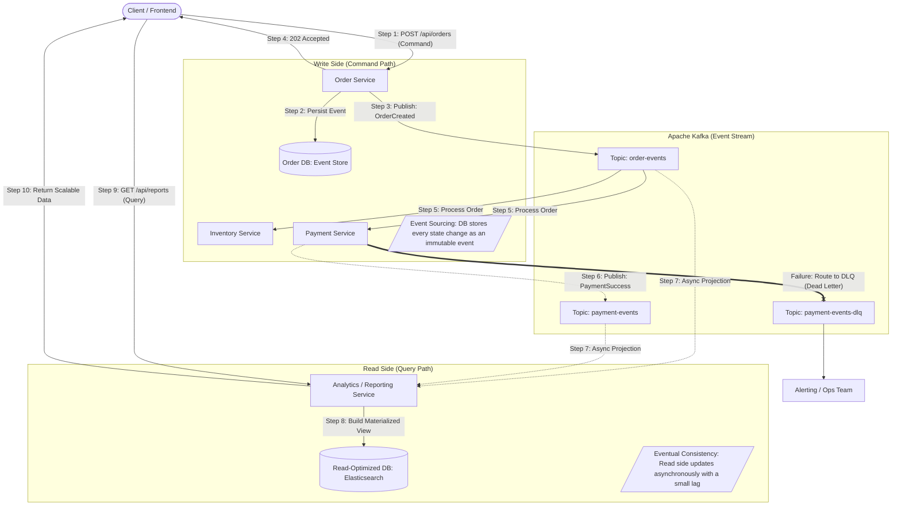

Here is a complete Product Requirements Document (`prd.md`) for a sample application that demonstrates the event-driven concepts (Pub/Sub, Decoupling, Backpressure, Dead-Letter Queues, and Eventual Consistency) required for a Staff/Architect level interview. 

This sample uses an **E-Commerce Order Fulfillment System** built with **Java Spring Boot** and **Apache Kafka**.

***

# Product Requirements Document (PRD)
**Project Name:** Async-Order-Fulfillment-System
**Document Status:** Approved
**Target Architecture:** Event-Driven Architecture (EDA) using Microservices
**Tech Stack:** Java 21, Spring Boot 3.x, Apache Kafka, PostgreSQL

## 1. Executive Summary
To move away from highly synchronous, latency-prone REST API chains, this project transitions our core order processing system to an asynchronous **Event-Driven Architecture (EDA)**. By utilizing a message broker (Apache Kafka), we will decouple the Order, Payment, and Inventory domains. This design guarantees fault tolerance, handles traffic spikes via backpressure, ensures eventual consistency, and safely routes unprocessable messages to Dead-Letter Queues (DLQs).

## 2. Architecture & Mermaid Flow Diagram

The following diagram illustrates how synchronous REST calls are immediately decoupled into asynchronous events using the Pub/Sub pattern.



## 3. System Components & Functions

### 3.1 Order Service (Publisher / Subscriber)
*   **Function:** The entry point for the user. It exposes a REST API (`POST /api/orders`) but does *not* wait for downstream systems to finish. 
*   **Action:** 
    1. Writes the order to the database with a `PENDING` status.
    2. Uses Spring's `KafkaTemplate<String, Object>` to publish an `OrderCreatedEvent` to Kafka.
    3. Immediately returns an HTTP `202 Accepted` to the client.
    4. Listens (Subscribes) to `payment-events` to update the order to `CONFIRMED` or `CANCELLED`.

### 3.2 Inventory Service (Subscriber)
*   **Function:** Manages stock levels. 
*   **Action:** Uses Spring's `@KafkaListener` to consume `OrderCreatedEvent`. It updates the local database to reserve items. Because Kafka retains messages, if this service goes offline, it will simply catch up on missed messages when it comes back online.

### 3.3 Payment Service (Subscriber / Publisher)
*   **Function:** Handles external payment gateways (e.g., Stripe/PayPal).
*   **Action:** Consumes `OrderCreatedEvent`. Upon successful charge, it publishes a `PaymentSuccessEvent`. If the user has insufficient funds, it publishes a `PaymentFailedEvent`.

### 3.4 Apache Kafka (Message Broker)
*   **Function:** The central nervous system of the architecture. It reliably stores events in topics and distributes them to consumer groups.

---

## 4. Addressing Staff-Level Architectural Concepts

This system specifically addresses the advanced system design patterns highlighted in your architectural review:

### A. Decoupling Systems (Pub/Sub)
Instead of the Order Service making a synchronous `RestTemplate` or `FeignClient` call to the Payment Service (which blocks threads and causes cascading failures if the Payment Service is down), we use the **Publish/Subscribe** pattern. The Order Service simply broadcasts a fact ("An order was created") and has no knowledge of who consumes it. 

### B. Handling Backpressure
If a massive traffic spike occurs (e.g., Black Friday), the Order Service can publish 10,000 events/second. The Payment Service might only be able to process 500 payments/second. 
*   **How it's handled:** Kafka acts as a buffer. The Payment Service pulls messages at its own pace. In Spring Boot, we configure `ConcurrentKafkaListenerContainerFactory` to set a maximum concurrency and batch size, naturally establishing backpressure without dropping requests or crashing the Payment Service.

### C. Dead-Letter Queues (DLQ)
What happens if the Payment Service encounters a bug or a malformed message (e.g., a missing JSON field) that cannot be parsed? Without intervention, it will infinitely retry and block the queue ("poison pill").
*   **How it's handled:** We implement a DLQ. Using Spring Kafka's `DeadLetterPublishingRecoverer` and `DefaultErrorHandler`, we configure the system to retry processing a message 3 times. If it still fails, Spring automatically routes the message to `payment-events-dlq` for manual engineering inspection, allowing the main queue to continue processing healthy messages.

### D. Eventual Consistency
Because the systems are decoupled, the database states are not updated in a single ACID transaction. 
*   **How it's handled:** We embrace **Eventual Consistency**. The user's screen says "Processing Order." A few seconds later, once the Order Service consumes the `PaymentSuccessEvent` from Kafka, it updates the database status from `PENDING` to `CONFIRMED`. If the user queries their order in the interim, they see the `PENDING` state.

---

## 5. Staff-Level Enhancement: Read Replicas & Projections

In a mature architecture, the relationship between CQRS, Event Sourcing, and Read Replicas is essential for scaling. This project implements the **Projection Pattern**, which is the advanced evolution of standard database read replicas.

| Pattern | Implementation in this System |
| :--- | :--- |
| **Physical Isolation** | The **Write Side** (Order Service) and **Read Side** (Analytics Service) use separate physical databases. This ensures heavy analytics queries never impact the latency of order placements. |
| **Polyglot Persistence** | While standard replicas mirror the source DB technology, our architecture allows for **Heterogeneous Replicas**. The Event Store (Write) uses a relational DB (PostgreSQL), while the Read Side uses a document-oriented store (Elasticsearch) optimized for search. |
| **Denormalization** | Unlike a standard read replica which maintains a normalized schema, our read-side projections are **denormalized**. Data from multiple events (Order, Payment, Inventory) is collapsed into a single "flattened" record, eliminating expensive SQL joins during reads. |
| **Recovery via Replay** | If the Read Side database is corrupted, we don't restore from a hardware backup. We simply **"replay" the Event Stream** from Kafka to a new database instance to rebuild the state from scratch. |

---

## 6. Sample Spring Boot Implementation Snippets

**1. Publishing the Event (Order Service)**
```java
@Service
@RequiredArgsConstructor
public class OrderService {
    private final OrderRepository repository;
    private final KafkaTemplate<String, OrderCreatedEvent> kafkaTemplate;

    @Transactional
    public Order createOrder(OrderRequest request) {
        // 1. Save to DB as PENDING
        Order order = new Order(request.getItems(), Status.PENDING);
        repository.save(order);

        // 2. Publish Event
        OrderCreatedEvent event = new OrderCreatedEvent(order.getId(), request.getUserId());
        kafkaTemplate.send("order-events", order.getId(), event);

        return order; // Returned to controller for HTTP 202
    }
}
```

**2. Consuming the Event (Payment Service)**
```java
@Service
@Slf4j
public class PaymentService {

    // Listens to Kafka topic, utilizing Spring Boot's built-in consumer concurrency
    @KafkaListener(topics = "order-events", groupId = "payment-group")
    public void handleOrderCreated(OrderCreatedEvent event) {
        log.info("Processing payment for Order ID: {}", event.getOrderId());
        // Process payment logic...
    }
}
```

**3. DLQ Configuration (Payment Service)**
```java
@Configuration
public class KafkaConfig {

    @Bean
    public DefaultErrorHandler errorHandler(KafkaTemplate<Object, Object> template) {
        // Automatically send to topicName-dlq after 3 failed attempts (Backoff: 1s, 2s, 4s)
        DeadLetterPublishingRecoverer recoverer = new DeadLetterPublishingRecoverer(template);
        BackOff backOff = new ExponentialBackOffWithMaxRetries(3);
        
        return new DefaultErrorHandler(recoverer, backOff);
    }
}
```

---

## 7. AWS Cloud-Native Alternative: SNS(Simple Notification Service) + SQS(Simple Queue Service) Fan-out

While Kafka is excellent for high-volume event streams and replayability, many enterprise AWS environments use **SNS + SQS** to achieve similar decoupling.

*   **SNS Role (Pub/Sub)**: Acts as the "Event Bus." It enables the **Fan-out Pattern**, where one event is broadcast to multiple independent queues.
*   **SQS Role (Buffer)**: Acts as the "Inbox" for each service. It provides **Asynchronous Decoupling** and **Backpressure**, ensuring that if the Inventory Service is slow, it doesn't block the Payment Service.
*   **Role Mapping**:
    *   **Kafka Topic** → SNS Topic + Multiple SQS Queues.
    *   **Kafka Partition** → SQS Queue (Note: SQS standard queues do not guarantee order; use **SQS FIFO** for strict ordering).

### Role Breakdown in AWS:

|Component|Kafka Equivalent|Role in the Application|
|---|---|---|
|**SNS Topic**|**Kafka Topic**|**The Broadcaster**: The `Order Service` publishes an `OrderCreated` event to one SNS Topic. SNS doesn't store data; it immediately pushes the event to all its subscribers.|
|**SQS Queue**|**Consumer Group**|**The Buffer**: Each microservice (`Inventory`, `Payment`) has its own SQS Queue that subscribes to the SNS Topic. This provides the **backpressure** and **durability** Kafka provides.|
|**Dead-Letter Queue**|**Kafka DLQ**|**The Catch-all**: SQS has native DLQ support. If a message fails after $X$ retries, SQS automatically moves it to a secondary DLQ for manual inspection.|
### The "Fan-out" Workflow:

1. **Order Service** publishes to `order-sns-topic`.
2. **SNS** automatically fans out the message to two different queues: `inventory-sqs-queue` and `payment-sqs-queue`.
3. **Inventory Service** pulls from its SQS queue.
4. **Payment Service** pulls from its SQS queue.

### Why use SNS + SQS instead of just SQS?

If the Order Service sent messages directly to an SQS queue, it would have to know about every downstream service. By using SNS as the entry point, the **Order Service remains decoupled**—it just publishes to the "Topic," and new services (like a "Marketing Service") can subscribe to that topic later without changing a single line of code in the Order Service.

---

### How to use this for your interview prep:
1. **Trace the flow:** Practice walking an interviewer through the Mermaid diagram from Step 1 to Step 10.
2. **Focus on the "Why":** If the interviewer asks "Why not just use an HTTP call from Order to Payment?", you can point directly to **Section 4A and 4B** (Cascading failures and Backpressure).
3. **Address the edge cases:** Staff-level interviews almost always test failure scenarios. **Section 4C (DLQs)** shows exactly how you handle poison-pill messages, while **Section 4D** proves you understand the tradeoff of abandoning ACID transactions for distributed Eventual Consistency.
4. **Cloud-Native Discussion**: Use **Section 7** to demonstrate that you can adapt these patterns to specific cloud providers (AWS SNS/SQS) and understand the architectural mapping between them.