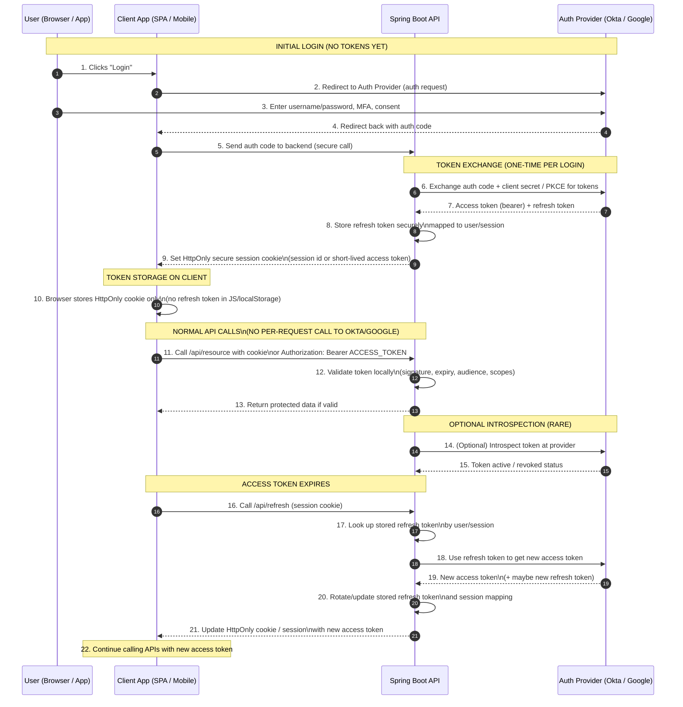

**10,000‑foot explanation** 

Think of three main pieces:

- **Client app**: your browser SPA (React/Vue/etc) or mobile app.
- **Middle tier**: your Java Spring Boot backend.
- **Auth provider**: Okta, Google, etc. (an OpenID Connect / OAuth 2.0 provider).

**1. How the bearer (access) token is generated** 
The normal modern pattern is the **Authorization Code flow with PKCE**:
1. The client app sends the user to Okta/Google’s hosted login page.
2. User logs in there (credentials never touch your backend).
3. Okta/Google redirects back to your app with a **short‑lived authorization code**.
4. Your Spring Boot backend takes that auth code (plus client credentials/PKCE verifier) and calls the provider’s **token endpoint**.
5. The provider returns:
- **Access token** (the “Bearer” token, usually a JWT)
- **Refresh token** (longer‑lived, not sent on every request)
- Optionally, an **ID token** describing the user.

The bearer token is just a signed blob that says “this user is X, with scopes Y, valid until time T”.

**2. Where the token is stored on the client** 

You have two common patterns:

- **Browser app (recommended):**

- Spring Boot returns an **HttpOnly, Secure cookie** that represents the session or directly contains an access token (or a session ID that maps to tokens server‑side).
- Because it’s HttpOnly, JavaScript can’t read it, which reduces XSS risk.
- The browser automatically attaches the cookie on requests to your domain.

- **Native/mobile clients:**

- The access token + refresh token are stored in **secure OS storage** (Keychain on iOS, Keystore on Android).
- The app manually sets `Authorization: Bearer <access_token>` on each API call.

At 10,000 feet: the client **never needs to “understand” the token**, it just holds it safely and sends it along.

**3. What the Spring Boot middle tier does** 

Your Spring Boot API acts as the **resource server** (and sometimes also the “confidential client” that talks to the provider).

For each incoming API request:

1. It extracts the bearer token:

- From `Authorization: Bearer <token>` header, or
- From a secure session/cookie that your backend maps to a token.

3. It **validates** the token:

- Check signature using provider’s public keys (JWKS).
- Check expiry (`exp`), issuer (`iss`), audience (`aud`), scopes/roles.

5. If valid, Spring Security populates a `SecurityContext` with the user’s identity and authorities.
6. Your controllers/services use that context to:

- Enforce authorization rules (e.g., `@PreAuthorize("hasRole('ADMIN')")`).
- Access user details (subject, email, etc.).

8. If invalid/expired, it returns `401 Unauthorized` or `403 Forbidden`.

So the middle tier is the gatekeeper: it **trusts tokens only if they’re valid according to Okta/Google** and then decides what the user can do.

**4. How the refresh token works** 

Access tokens are intentionally **short‑lived** (minutes) to limit damage if stolen. The **refresh token** exists precisely so the user doesn’t have to log in again every 10 minutes.

High‑level flow:

1. **Access token expires.**

- The client calls an API and gets `401 Unauthorized` or knows from its own expiry timer that the token is stale.

3. **Client asks for a refresh.**

- It calls a special endpoint on your Spring Boot API (e.g., `/auth/refresh`).
- It sends either:

- A refresh token (mobile/native), or
- A secure cookie/session that your backend uses to look up the stored refresh token.

5. **Backend talks to provider.**

- Spring Boot calls the provider’s **token endpoint** again, this time with:

- `grant_type=refresh_token`
- The refresh token
- Client credentials / PKCE as required.

7. **Provider replies with a new access token** (and possibly a new refresh token).
8. **Backend updates the client’s state.**

- Returns a new HttpOnly cookie / session update, or
- Returns the new access token (and maybe refresh token) to a trusted native client, which stores it securely.

10. Client continues making API calls with the **new access token**, no user interaction needed.

Eventually the refresh token itself can expire or be revoked. At that point, the refresh call fails and the user must fully re‑authenticate via the login redirect.

This is the conceptual model: **provider issues tokens, client stores and sends them, Spring Boot validates and enforces access, and refresh tokens quietly keep sessions alive without repeated logins**.

