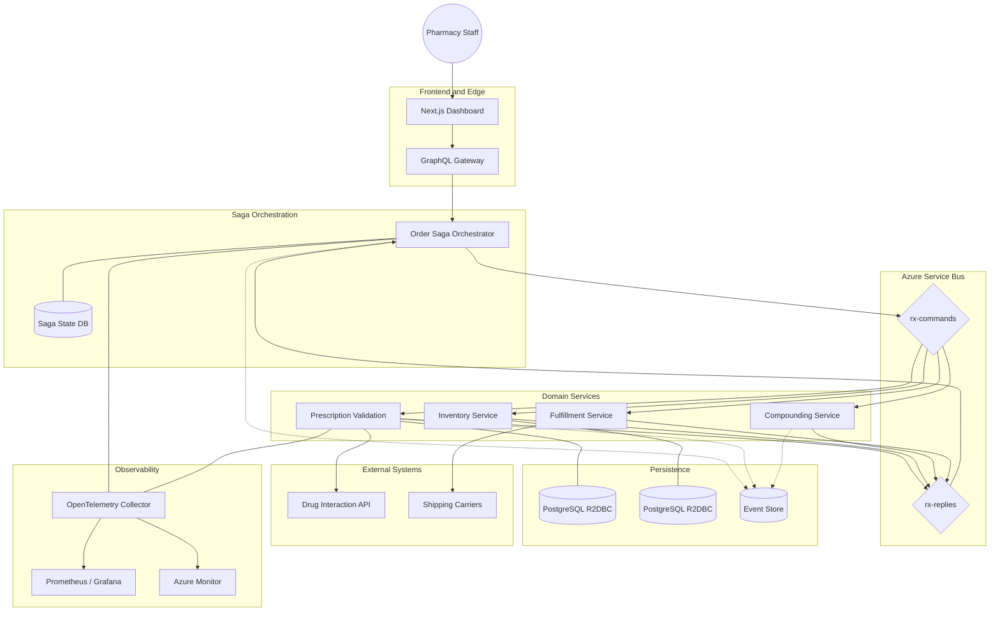

## I. Why Add an Orchestrator

### The problem with pure choreography

**Choreography scatters failure logic across every service.** In the current design, if compounding fails after inventory is reserved, the Compounding Service must publish `CompoundingFailed`, and the Inventory Service must subscribe to that event and know to unreserve. Add insurance denial, partial compounding, and pharmacist override flows — each service needs awareness of failure modes it shouldn’t own.

| Concern               | Choreography                           | Orchestrator Saga                       |
| --------------------- | -------------------------------------- | --------------------------------------- |
| Failure routing       | Distributed across all services        | Centralized in one state machine        |
| Compensation ordering | Implicit (hope events arrive in order) | Explicit (orchestrator drives sequence) |
| Workflow visibility   | Reconstruct from event logs            | Query saga state directly               |
| Adding new steps      | New subscriptions + filters everywhere | One new state transition                |
| Audit trail           | Correlate across service event stores  | Saga log is the single narrative        |

---
## Component Diagram


## II. Saga State Machine

### States and transitions

**Nine states, six forward transitions, four compensating paths.** The orchestrator advances the saga on success replies and reverses on failures.

```
                     ┌──────────────┐  
                     │   CREATED    │  
                     └──────┬───────┘  
                   cmd: ValidateOrder  
                            │  
                     ┌──────▼───────┐     fail     ┌──────────────┐  
                     │  VALIDATING  ├─────────────►│  REJECTED    │  
                     └──────┬───────┘              └──────────────┘  
                   reply: ValidationSucceeded  
                            │  
                     ┌──────▼───────┐     fail     ┌──────────────┐  
                     │  RESERVING   ├─────────────►│  RESERVE_    │  
                     │  _INVENTORY  │              │  FAILED      │  
                     └──────┬───────┘              └──────────────┘  
                   reply: InventoryReserved  
                            │  
                     ┌──────▼───────┐     fail     ┌──────────────┐  
                     │ COMPOUNDING  ├─────────────►│ COMPENSATING │  
                     │              │              │ _INVENTORY   │  
                     └──────┬───────┘              └──────┬───────┘  
                   reply: CompoundingComplete        cmd: ReleaseInventory  
                            │                              │  
                     ┌──────▼───────┐              ┌──────▼───────┐  
                     │  FULFILLING  │              │   FAILED     │  
                     └──────┬───────┘              └──────────────┘  
                   reply: OrderShipped    fail  
                            │          ┌──────────────────┐  
                     ┌──────▼───────┐  │ COMPENSATING     │  
                     │  COMPLETED   │  │ _COMPOUND_AND_   │  
                     └──────────────┘  │ _INVENTORY       │  
                                       └──────────────────┘  
```

### State enum and transition table

```java
public enum SagaState {  
    CREATED,  
    VALIDATING,  
    RESERVING_INVENTORY,  
    COMPOUNDING,  
    FULFILLING,  
    COMPLETED,  
  
    // Compensation states  
    COMPENSATING_INVENTORY,  
    COMPENSATING_COMPOUND_AND_INVENTORY,  
  
    // Terminal failure states  
    REJECTED,          // Validation failed (no compensation needed)  
    RESERVE_FAILED,    // No stock (no compensation needed)  
    FAILED             // Compensation complete, order dead  
}  
```

|Current State|Event Received|Next State|Command Issued|
|---|---|---|---|
|`CREATED`|—|`VALIDATING`|`ValidateOrder`|
|`VALIDATING`|`ValidationSucceeded`|`RESERVING_INVENTORY`|`ReserveInventory`|
|`VALIDATING`|`ValidationFailed`|`REJECTED`|— (terminal)|
|`RESERVING_INVENTORY`|`InventoryReserved`|`COMPOUNDING`|`StartCompounding`|
|`RESERVING_INVENTORY`|`ReservationFailed`|`RESERVE_FAILED`|— (terminal, notify staff)|
|`COMPOUNDING`|`CompoundingComplete`|`FULFILLING`|`FulfillOrder`|
|`COMPOUNDING`|`CompoundingFailed`|`COMPENSATING_INVENTORY`|`ReleaseInventory`|
|`FULFILLING`|`OrderShipped`|`COMPLETED`|— (terminal)|
|`FULFILLING`|`FulfillmentFailed`|`COMPENSATING_COMPOUND_AND_INVENTORY`|`ReverseCompounding`|
|`COMPENSATING_INVENTORY`|`InventoryReleased`|`FAILED`|— (terminal)|
|`COMPENSATING_COMPOUND_AND_INVENTORY`|`CompoundingReversed`|`COMPENSATING_INVENTORY`|`ReleaseInventory`|

Each compensation step runs in reverse order of the original steps. Fulfillment failure triggers: reverse compounding → release inventory → terminal FAILED state.

---

## III. Orchestrator Service Implementation

### 1. Saga aggregate

**The saga is a persistent entity with its own table.** Each row tracks one order’s journey through the state machine.

```sql
CREATE TABLE order_sagas (  
    saga_id         UUID PRIMARY KEY,  
    order_id        UUID NOT NULL UNIQUE,  
    current_state   VARCHAR(50) NOT NULL,  
    created_at      TIMESTAMPTZ NOT NULL DEFAULT now(),  
    updated_at      TIMESTAMPTZ NOT NULL DEFAULT now(),  
    failure_reason  TEXT,  
    retry_count     INT NOT NULL DEFAULT 0,  
    version         BIGINT NOT NULL DEFAULT 0   -- Optimistic locking  
);  
  
CREATE TABLE saga_steps (  
    step_id         UUID PRIMARY KEY,  
    saga_id         UUID NOT NULL REFERENCES order_sagas(saga_id),  
    step_name       VARCHAR(50) NOT NULL,  
    command_sent    VARCHAR(100) NOT NULL,  
    reply_received  VARCHAR(100),  
    status          VARCHAR(20) NOT NULL,       -- PENDING, SUCCEEDED, FAILED, COMPENSATED  
    started_at      TIMESTAMPTZ NOT NULL,  
    completed_at    TIMESTAMPTZ,  
    payload         JSONB  
);  
```

### 2. Core orchestrator logic

```java
@Service  
public class OrderSagaOrchestrator {  
  
    private final SagaRepository sagaRepo;  
    private final CommandPublisher publisher;  
    private final EventStoreAppender eventStore;  
  
    // Called when a new order is created  
    public Mono<Void> startSaga(OrderCreatedEvent event) {  
        OrderSaga saga = OrderSaga.create(event.orderId());  
        return sagaRepo.save(saga)  
            .flatMap(s -> advance(s));  
    }  
  
    // Called when any service replies  
    public Mono<Void> handleReply(SagaReply reply) {  
        return sagaRepo.findByOrderId(reply.orderId())  
            .flatMap(saga -> {  
                saga.applyReply(reply);          // State transition  
                return sagaRepo.save(saga)       // Persist new state  
                    .flatMap(s -> advance(s));   // Issue next command  
            });  
    }  
  
    private Mono<Void> advance(OrderSaga saga) {  
        return switch (saga.state()) {  
            case VALIDATING ->  
                publisher.send("rx-commands", new ValidateOrderCmd(  
                    saga.orderId()));  
  
            case RESERVING_INVENTORY ->  
                publisher.send("rx-commands", new ReserveInventoryCmd(  
                    saga.orderId()));  
  
            case COMPOUNDING ->  
                publisher.send("rx-commands", new StartCompoundingCmd(  
                    saga.orderId()));  
  
            case FULFILLING ->  
                publisher.send("rx-commands", new FulfillOrderCmd(  
                    saga.orderId()));  
  
            // Compensation commands  
            case COMPENSATING_INVENTORY ->  
                publisher.send("rx-commands", new ReleaseInventoryCmd(  
                    saga.orderId()));  
  
            case COMPENSATING_COMPOUND_AND_INVENTORY ->  
                publisher.send("rx-commands", new ReverseCompoundingCmd(  
                    saga.orderId()));  
  
            // Terminal states — log and stop  
            case COMPLETED ->  
                eventStore.append(saga.orderId(), "SagaCompleted")  
                    .then();  
  
            case REJECTED, RESERVE_FAILED, FAILED ->  
                eventStore.append(saga.orderId(), "SagaFailed",  
                    saga.failureReason())  
                    .then();  
  
            default -> Mono.empty();  
        };  
    }  
}  
```

### 3. State transition in the saga entity

```java
public class OrderSaga {  
    private SagaState state;  
    private String failureReason;  
  
    public void applyReply(SagaReply reply) {  
        this.state = switch (this.state) {  
            case VALIDATING -> switch (reply.outcome()) {  
                case SUCCESS -> SagaState.RESERVING_INVENTORY;  
                case FAILURE -> {  
                    this.failureReason = reply.reason();  
                    yield SagaState.REJECTED;  
                }  
            };  
            case RESERVING_INVENTORY -> switch (reply.outcome()) {  
                case SUCCESS -> SagaState.COMPOUNDING;  
                case FAILURE -> {  
                    this.failureReason = reply.reason();  
                    yield SagaState.RESERVE_FAILED;  
                }  
            };  
            case COMPOUNDING -> switch (reply.outcome()) {  
                case SUCCESS -> SagaState.FULFILLING;  
                case FAILURE -> {  
                    this.failureReason = reply.reason();  
                    yield SagaState.COMPENSATING_INVENTORY;  
                }  
            };  
            case FULFILLING -> switch (reply.outcome()) {  
                case SUCCESS -> SagaState.COMPLETED;  
                case FAILURE -> {  
                    this.failureReason = reply.reason();  
                    yield SagaState.COMPENSATING_COMPOUND_AND_INVENTORY;  
                }  
            };  
            // Compensation replies  
            case COMPENSATING_COMPOUND_AND_INVENTORY ->  
                SagaState.COMPENSATING_INVENTORY;  
            case COMPENSATING_INVENTORY ->  
                SagaState.FAILED;  
  
            default -> throw new IllegalStateException(  
                "No transition from " + state + " for " + reply);  
        };  
    }  
}  
```

---
## IV. ASB Messaging Topology
### Commands vs. Replies
**Two topics replace the four in the choreography design.** The orchestrator sends commands on one topic and listens for replies on another.

| Topic         | Direction               | Session Key | Subscriptions                                  |
| ------------- | ----------------------- | ----------- | ---------------------------------------------- |
| `rx-commands` | Orchestrator → Services | `orderId`   | One per service, SQL-filtered by `commandType` |
| `rx-replies`  | Services → Orchestrator | `orderId`   | Single subscription, orchestrator consumes all |

```
// rx-commands subscriptions with SQL filters:  
// sub-validation-cmds:   commandType IN ('ValidateOrder')  
// sub-inventory-cmds:    commandType IN ('ReserveInventory', 'ReleaseInventory')  
// sub-compounding-cmds:  commandType IN ('StartCompounding', 'ReverseCompounding')  
// sub-fulfillment-cmds:  commandType IN ('FulfillOrder')  
```
Services remain decoupled — they receive typed commands and return typed replies. They never see or import each other’s code. The orchestrator is the only component that knows the full workflow.
### Reply contract
**Every service reply follows a uniform envelope.**
```java
public record SagaReply(  
    UUID orderId,  
    String replyType,      // "ValidationSucceeded", "CompoundingFailed"  
    Outcome outcome,       // SUCCESS or FAILURE  
    String reason,         // null on success, human-readable on failure  
    Instant timestamp,  
    String traceId  
) {}  
  
// Each service publishes to rx-replies:  
ServiceBusMessage reply = new ServiceBusMessage(json)  
    .setSessionId(orderId.toString())  
    .setSubject("ValidationSucceeded")  
    .setCorrelationId(incomingTraceId);  
  
replySender.sendMessage(reply);  
```

---
## V. Failure Handling Deep Dive
### 1. Timeout watchdog
**If a service never replies, the orchestrator must not hang forever.** A scheduled job polls for sagas stuck in non-terminal states beyond their SLA.
```java
@Scheduled(fixedDelay = 60_000)  
public void checkStaleSagas() {  
    sagaRepo.findStale(Duration.ofMinutes(10))  
        .flatMap(saga -> {  
            if (saga.retryCount() < 3) {  
                saga.incrementRetry();  
                return sagaRepo.save(saga)  
                    .flatMap(s -> advance(s));  // Re-send command  
            } else {  
                saga.forceCompensate("Timeout after 3 retries");  
                return sagaRepo.save(saga)  
                    .flatMap(s -> advance(s));  // Start compensation  
            }  
        })  
        .subscribe();  
}  
```

After 3 retries (30 minutes total), the orchestrator begins compensating and alerts the operations team.
### 2. Compensation failure
**What if `ReleaseInventory` itself fails?** The saga enters a `COMPENSATION_STUCK` state and raises a critical alert. A human operator resolves it manually via an admin endpoint.
- The `saga_steps` table records exactly which compensations succeeded and which are pending.
- The admin dashboard shows a “stuck sagas” view with one-click retry or manual override.
- For controlled substances, a stuck compensation triggers a compliance notification per DEA rules.
### 3. Idempotent commands
**Because the orchestrator may retry commands, every service handler must be idempotent.** Services check a `commandId` (included in every command) against Redis before processing. The orchestrator generates a deterministic `commandId` from `sagaId + stepName + retryCount` so retries of the same step produce the same key.

---
## VI. 30-Minute Interview Walkthrough
### Minutes 0–5: Context
**Set the domain.** “This is a prescription order management system — not a standard retail OMS. It has mandatory clinical validation, controlled substance tracking, and a compounding step where medications are custom-manufactured.”
- Draw the five services on the whiteboard.
- State the key constraint: HIPAA requires an immutable audit trail for every state change.
### Minutes 5–12: Happy Path
**Walk through the saga forward flow.** Draw the state machine. Explain: “The orchestrator sends a command to each service in sequence. Each service does its work and publishes a reply. The orchestrator advances the state machine on success.”
- Mention ASB sessions keyed by orderId for FIFO.
- Mention the two-topic pattern (commands / replies) and why it’s cleaner than choreography for this domain.
### Minutes 12–20: Failure Paths
**This is where you differentiate yourself.** Walk through two failure scenarios:
- **Compounding failure:** “Compounding fails → orchestrator transitions to COMPENSATING_INVENTORY → sends ReleaseInventory → on reply, transitions to FAILED. One place controls the entire rollback sequence.”
- **Timeout:** “If Validation never replies, a watchdog retries 3 times, then forces compensation. The saga never hangs.”
- Contrast with choreography: “In pure choreography, who owns the timeout? Who decides when to compensate? Every service would need that logic.”
### Minutes 20–25: Data Layer
**Show the persistence model.**
- `order_sagas` table with optimistic locking via `version` column.
- `saga_steps` for granular audit: which command was sent, when, what reply came back.
- Event Store integration: every saga state transition appends to the append-only event store for HIPAA compliance.
- Mention that the saga table uses R2DBC like all other services — reactive end-to-end.
### Minutes 25–30: Trade-offs
**Demonstrate architectural maturity by discussing what you gave up.**

| Trade-off                | Your Position                                                                                                                                                                                                        |
| ------------------------ | -------------------------------------------------------------------------------------------------------------------------------------------------------------------------------------------------------------------- |
| Single point of failure? | The orchestrator is stateless — saga state lives in PostgreSQL. Multiple replicas behind KEDA. If a pod dies, another picks up the saga from its persisted state.                                                    |
| Coupling?                | The orchestrator knows the workflow shape, but services remain decoupled — they receive typed commands and return typed replies. Adding a new service means adding one state transition, not rewiring subscriptions. |
| Performance overhead?    | One extra hop per step (service → orchestrator → next service). At pharmacy scale (thousands/day, not millions/second), this latency is irrelevant. Correctness of compensation matters more.                        |
| Why not Temporal?        | Temporal is excellent but adds operational complexity. For 5 services with a linear flow + 2 compensation paths, a hand-rolled state machine is simpler to reason about and debug.                                   |

-----

**Service Responsibilities by Saga State**

**Forward Flow**
Prescription Validation Service **Command received:** `ValidateOrder`
**What it does:**
1. Pulls patient medication history
2. Calls external DDI API to check drug-drug interactions
3. If DDI severity is MAJOR or CONTRAINDICATED, queues for pharmacist review
4. Pharmacist approves, overrides (with reason), or rejects
**Success reply:** `ValidationSucceeded`  
**Failure reply:** `ValidationFailed` (reason: DDI contraindication, pharmacist rejection, or DDI API unavailable)

Inventory Service **Command received:** `ReserveInventory`
**What it does:**
1. Looks up required ingredients/medications for the order
2. Checks stock levels
3. Decrements available quantities and creates a reservation record tied to the orderId
4. Sets a reservation TTL (e.g., 24h) so stock isn’t locked forever if the saga fails silently
**Success reply:** `InventoryReserved`  
**Failure reply:** `ReservationFailed` (reason: insufficient stock, ingredient unavailable)

Compounding Service **Command received:** `StartCompounding`
**What it does:**
1. Creates a manufacturing work order
2. Tracks the compounding process (mixing, QA checks, packaging)
3. Records batch number and lot tracking for traceability
4. This is the black-box manufacturing step — the orchestrator just waits for completion
**Success reply:** `CompoundingComplete`  
**Failure reply:** `CompoundingFailed` (reason: QA failure, equipment error, ingredient contamination)

Fulfillment Service **Command received:** `FulfillOrder`
**What it does:**
1. Generates shipping label via carrier API
2. Assigns tracking number
3. Schedules pickup or drop-off
4. For controlled substances, generates the required chain-of-custody documentation
**Success reply:** `OrderShipped`  
**Failure reply:** `FulfillmentFailed` (reason: carrier API error, address validation failure, controlled substance documentation incomplete)

**Compensation Flow**
Inventory Service (Compensation) **Command received:** `ReleaseInventory`
**What it does:**
1. Finds the reservation record by orderId
2. Restores the reserved quantities back to available stock
3. Deletes the reservation record
**Success reply:** `InventoryReleased`  
**Failure handling:** Retried indefinitely — this _must_ succeed for data consistency

Compounding Service (Compensation) **Command received:** `ReverseCompounding`
**What it does:**
1. Marks the batch as voided/quarantined
2. Logs the waste for regulatory reporting
3. Does _not_ return ingredients to inventory — that’s a separate `ReleaseInventory` step the orchestrator handles next
**Success reply:** `CompoundingReversed`  
**Failure handling:** Retried indefinitely

**Key Interview Points**
[!important] Early failures need no compensation  
If Validation rejects the order, nothing has been reserved or manufactured yet — the saga goes straight to `REJECTED` with no rollback. Same for `ReservationFailed`. Compensation only kicks in when a step fails _after_ a previous step has already changed state (reserved stock, started manufacturing).
[!warning] Compensation commands must eventually succeed  
`ReleaseInventory` and `ReverseCompounding` are retried until they work. If they’re permanently stuck (database down, data corruption), the saga enters `COMPENSATION_STUCK` and alerts a human. You can’t just give up on a compensation — that leaves the system in an inconsistent state.

-------

Correlation ID is for **humans debugging** (find everything related to order X). Idempotency key is for **machines** (don’t do the same work twice).

**Session Id and Idempotency key:**
**They never interact with each other directly.** The session ID is handled entirely by ASB’s broker — your application code never reads it during processing. The idempotency key is handled entirely by your application code — ASB doesn’t care about it. They’re two independent safety mechanisms operating at different layers:

- **Session ID** = infrastructure layer (ASB broker manages ordering)
- **Idempotency key** = application layer (your code manages dedup in Redis)