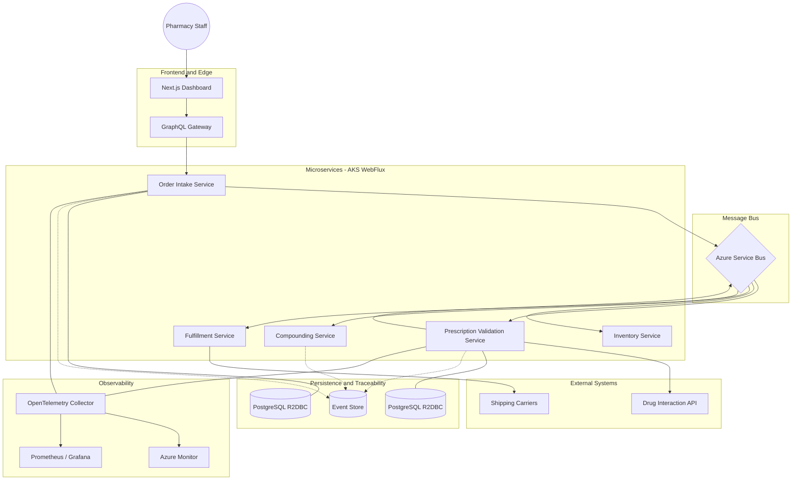

# Prescription Order Management System

## Architecture Overview

### Guiding Principles

**Event-driven choreography over orchestration.** Each service owns one bounded context and communicates exclusively through Azure Service Bus topics. No service calls another directly — the message bus is the only coupling point.
- **Reactive end-to-end:** Spring WebFlux (Project Reactor) from HTTP ingress through R2DBC persistence — no blocking threads.
- **Event sourcing for compliance:** Every state transition is an immutable, append-only event. This isn’t optional architecture — it’s a legal requirement under HIPAA and DEA Title 21 CFR Part 1304.
- **Session-keyed ordering:** Azure Service Bus sessions guarantee FIFO processing per order while allowing parallel processing across orders.
- **Polyglot persistence:** PostgreSQL (R2DBC) for operational state, a dedicated Event Store for the append-only audit log, Redis for caching and idempotency keys.
### How It Differs from a Standard OMS
A Prescription Order Management System is a **Healthcare/Clinical OMS**. While a standard OMS focuses on inventory and shipping, a prescription system must handle:

|Concern|Standard OMS|Prescription OMS|
|---|---|---|
|Validation|Address/payment check|Mandatory pharmacist review + Drug-Drug Interaction (DDI) checks|
|Compliance|PCI-DSS for payments|HIPAA (privacy), DEA/FDA (controlled substances), State Board of Pharmacy rules|
|Fulfillment|Pick and pack|Custom compounding/manufacturing of medications|
|Audit trail|Nice-to-have feature|Legal requirement — Event Sourcing is a compliance necessity|
### Request Flow
A prescription moves through five stages, each owned by a single service.

| Stage              | Service                 | ASB Topic        | Key Action                                                                      |
| ------------------ | ----------------------- | ---------------- | ------------------------------------------------------------------------------- |
| 1. Intake          | Order Intake            | `rx-intake`      | Validate schema, assign OrderID, persist draft, publish `OrderCreated`          |
| 2. Clinical Review | Prescription Validation | `rx-validation`  | DDI check via external API, pharmacist approval queue, publish `OrderValidated` |
| 3. Inventory       | Inventory               | `rx-inventory`   | Reserve ingredients, decrement stock, publish `InventoryReserved`               |
| 4. Compounding     | Compounding             | —                | Black-box manufacturing step; publishes `CompoundingComplete`                   |
| 5. Fulfillment     | Fulfillment             | `rx-fulfillment` | Generate shipping label, hand off to carrier, publish `OrderShipped`            |

### Component Diagram



---

## Service Internals — Java / Spring WebFlux

### Project Structure (Hexagonal Architecture)

Each microservice follows a ports-and-adapters layout. Domain logic has zero framework dependencies — Spring and messaging are adapters plugged into domain ports.

```
order-intake-service/  
├── domain/  
│   ├── model/          # Order, Prescription, Patient (immutable records)  
│   ├── event/          # OrderCreated, OrderFailed (sealed interface)  
│   ├── port/  
│   │   ├── inbound/    # CreateOrderUseCase (interface)  
│   │   └── outbound/   # OrderRepository, EventPublisher (interfaces)  
│   └── service/        # CreateOrderService (pure domain logic)  
├── adapter/  
│   ├── inbound/  
│   │   ├── graphql/    # OrderMutationResolver, OrderQueryResolver  
│   │   └── messaging/  # AsbOrderListener (ServiceBusProcessorClient)  
│   ├── outbound/  
│   │   ├── persistence/# R2dbcOrderRepository implements OrderRepository  
│   │   ├── messaging/  # AsbEventPublisher implements EventPublisher  
│   │   └── eventsource/# AppendOnlyEventStore  
│   └── config/         # Spring @Configuration beans  
├── Dockerfile  
└── helm/  
```
### GraphQL Schema (DGS Federation)
The GraphQL Gateway aggregates all service schemas via Netflix DGS Federation. Each service exposes its own subgraph; the gateway composes them into a single endpoint.
```graphql hl:2-9
# --- Order Intake Subgraph ---  
type Mutation {  
  createOrder(input: CreateOrderInput!): OrderPayload!  
  cancelOrder(orderId: ID!): OrderPayload!  
}  
type Query {  
  order(id: ID!): Order  
  orders(filter: OrderFilter, page: PageInput): OrderConnection!  
}  
input CreateOrderInput {  
  patientId: ID!  
  prescriberId: ID!  
  medications: [MedicationLineInput!]!  
  priority: Priority = STANDARD  
}  
  
type Order @key(fields: "id") {  
  id: ID!  
  status: OrderStatus!  
  patient: Patient!  
  medications: [MedicationLine!]!  
  events: [OrderEvent!]!      # Full event history for traceability  
  createdAt: DateTime!  
  updatedAt: DateTime!  
}  
  
enum OrderStatus {  
  DRAFT  
  INTAKE_COMPLETE  
  VALIDATING  
  VALIDATED  
  INVENTORY_RESERVED  
  COMPOUNDING  
  COMPOUNDED  
  FULFILLING  
  SHIPPED  
  DELIVERED  
  CANCELLED  
  ON_HOLD  
}  
  
# --- Prescription Validation Subgraph ---  
extend type Order @key(fields: "id") {  
  id: ID! @external  
  validation: ValidationResult  
}  
  
type ValidationResult {  
  status: ValidationStatus!  
  ddiChecks: [DrugInteraction!]!  
  pharmacistId: ID  
  reviewedAt: DateTime  
  overrideReason: String       # Required if pharmacist overrides DDI warning  
}  
  
type DrugInteraction {  
  drugA: String!  
  drugB: String!  
  severity: Severity!          # CONTRAINDICATED | MAJOR | MODERATE | MINOR  
  description: String!  
}  
```

> [!tip] Interview talking point  
> The `events` field on the `Order` type exposes the full event-sourced history directly in the API. An interviewer asking “how do you audit?” gets a one-line answer: query the `events` field.
### Reactive Persistence (R2DBC)
Each service owns its database schema — no shared databases.
```java
// Domain port (no framework dependency)  
public interface OrderRepository {  
    Mono<Order> findById(OrderId id);  
    Mono<Order> save(Order order);  
    Flux<Order> findByStatus(OrderStatus status);  
}  
// R2DBC adapter  
@Repository  
public class R2dbcOrderRepository implements OrderRepository {  
    private final DatabaseClient client;  
    @Override  
    public Mono<Order> save(Order order) {  
        return client.sql("""  
            INSERT INTO orders (id, patient_id, status, created_at)  
            VALUES (:id, :patientId, :status, :createdAt)  
            ON CONFLICT (id) DO UPDATE SET status = :status  
            """)  
            .bind("id", order.id().value())  
            .bind("patientId", order.patientId().value())  
            .bind("status", order.status().name())  
            .bind("createdAt", order.createdAt())  
            .fetch().rowsUpdated()  
            .thenReturn(order);  
    }  
}  
```
### DGS Federation Gateway
- ==**DataLoader pattern:** Batch-resolves `Patient` and `Medication` references across services to avoid N+1 queries.==
- ==**Subscriptions:** WebSocket subscriptions on `orderStatusChanged(orderId)` push real-time updates to the Next.js dashboard.==
- **Auth:** ==JWT validation at the gateway.== Claims propagated downstream via HTTP headers. Services trust the gateway’s validation — no redundant token parsing.
---
## Azure Service Bus — Messaging Design
### Topic & Subscription Topology
Four topics form the event backbone. Each topic has one or more subscriptions with SQL filter rules, so services only receive events they care about.

|Topic|Subscription|SQL Filter|Consumer|
|---|---|---|---|
|`rx-intake`|`sub-validation`|`eventType = 'OrderCreated'`|Validation Service|
|`rx-validation`|`sub-inventory`|`eventType = 'OrderValidated'`|Inventory Service|
|`rx-validation`|`sub-hold-notify`|`eventType = 'OrderOnHold'`|Notification Service|
|`rx-inventory`|`sub-compounding`|`eventType = 'InventoryReserved'`|Compounding Service|
|`rx-fulfillment`|`sub-shipping`|`eventType = 'CompoundingComplete'`|Fulfillment Service|
### Sessions for FIFO Ordering
Sessions are keyed by `orderId`. All events for a single prescription process in strict order; different prescriptions process in parallel across consumers.
```java
// Publishing with session  
ServiceBusSenderClient sender = clientBuilder  
    .sender().topicName("rx-intake").buildClient();  
  
ServiceBusMessage message = new ServiceBusMessage(eventJson)  
    .setSessionId(order.id().value())          // FIFO per order  
    .setContentType("application/json")  
    .setSubject("OrderCreated")                // Used by SQL filters  
    .setMessageId(UUID.randomUUID().toString())// Dedup key  
    .setCorrelationId(traceId);                // OpenTelemetry propagation  
  
sender.sendMessage(message);  
  
// Consuming with session  
ServiceBusProcessorClient processor = clientBuilder  
    .sessionProcessor()  
    .topicName("rx-intake")  
    .subscriptionName("sub-validation")  
    .processMessage(this::handleMessage)  
    .processError(this::handleError)  
    .maxConcurrentSessions(10)       // 10 orders processed in parallel  
    .maxConcurrentCallsPerSession(1) // Strict FIFO within each order  
    .buildProcessorClient();  
```

> [!info] Why sessions over Kafka partitions?  
> Sessions allow dynamic, fine-grained ordering (one session per order) without pre-allocating partition counts. A pharmacy processing 10,000 orders/day gets 10,000 independent FIFO streams. Kafka would require pre-sizing partitions and re-keying on schema changes.

### Dead-Letter & Retry Strategy
Three-tier retry with exponential backoff, then dead-letter for human review.
- **Tier 1 — Immediate retry (3×):** Built-in ASB retry with 2s/4s/8s backoff. Handles transient network blips.
- **Tier 2 — Deferred retry:** On 4th failure, message scheduled for redelivery 5 min later via `ScheduledEnqueueTime`. Handles downstream service restarts.
- **Tier 3 — Dead-letter queue (DLQ):** After `MaxDeliveryCount = 5`, message lands in DLQ. A dedicated DLQ processor alerts the operations team via the dashboard and logs `OrderProcessingFailed` in the Event Store.
Poison messages (malformed JSON, unknown event types) are immediately dead-lettered with `deadLetterReason` set — no retries wasted.

### Idempotency
At-least-once delivery requires idempotent consumers. Each handler checks a Redis-backed idempotency store before processing.

```java
public Mono<Void> handleMessage(ServiceBusReceivedMessage msg) {  
    String idempotencyKey = msg.getMessageId();  
  
    return redisOps.opsForValue()  
        .setIfAbsent(idempotencyKey, "PROCESSING", Duration.ofHours(24))  
        .flatMap(acquired -> {  
            if (!acquired) {  
                return Mono.empty(); // Already processed — skip  
            }  
            return processEvent(msg)  
                .doOnSuccess(v ->  
                    redisOps.opsForValue()  
                        .set(idempotencyKey, "DONE", Duration.ofDays(7))  
                        .subscribe());  
        });  
}  
```

---

## Next.js Frontend

### App Router Architecture

Next.js 14+ App Router with server components for initial data fetch, client components for real-time updates.

```
app/  
├── layout.tsx                  # Auth provider, Apollo wrapper  
├── dashboard/  
│   ├── page.tsx                # Server component: fetch order summary  
│   └── _components/  
│       ├── OrderTable.tsx      # Client: filterable, sortable order list  
│       └── StatusBadge.tsx     # Shared component  
├── orders/  
│   ├── [id]/  
│   │   ├── page.tsx            # Server: fetch order detail + event history  
│   │   └── _components/  
│   │       ├── EventTimeline.tsx   # Client: real-time event stream  
│   │       ├── ValidationPanel.tsx # DDI results, pharmacist actions  
│   │       └── OrderActions.tsx    # Cancel, hold, override  
│   └── new/  
│       └── page.tsx            # Client: multi-step order intake form  
├── inventory/  
│   └── page.tsx                # Server: stock levels, alerts  
└── lib/  
    ├── graphql/  
    │   ├── client.ts           # Apollo Client config (SSR + CSR)  
    │   ├── queries.ts          # Typed queries via graphql-codegen  
    │   └── subscriptions.ts    # WebSocket subscription hooks  
    └── auth/  
        └── middleware.ts       # NextAuth.js + Azure AD B2C  
```
### Real-Time Updates
GraphQL subscriptions over WebSocket push order status changes to the dashboard in real time.

```tsx
'use client';  
  
const ORDER_EVENTS_SUB = gql`  
  subscription OnOrderEvent($orderId: ID!) {  
    orderStatusChanged(orderId: $orderId) {  
      status  
      timestamp  
      actor  
      details  
    }  
  }  
`;  
  
export function EventTimeline({ orderId }: { orderId: string }) {  
  const { data } = useSubscription(ORDER_EVENTS_SUB, {  
    variables: { orderId },  
  });  
  // Renders a vertical timeline that appends events in real time  
}  
```

Apollo Client’s `cache.modify` appends new events to the existing `Order.events` list — no refetch needed. The dashboard order table uses a separate `ordersUpdated` subscription to reflect status badge changes across all visible rows.

---
## AKS Deployment & Docker
### Dockerfile — Multi-Stage
Three-stage build: dependency cache → compile → minimal runtime.
```dockerfile
# Stage 1: Cache dependencies  
FROM eclipse-temurin:21-jdk AS deps  
WORKDIR /app  
COPY build.gradle.kts settings.gradle.kts ./  
COPY gradle/ gradle/  
RUN ./gradlew dependencies --no-daemon  
  
# Stage 2: Build  
FROM deps AS build  
COPY src/ src/  
RUN ./gradlew bootJar --no-daemon -x test  
  
# Stage 3: Runtime (distroless — no shell, no package manager)  
FROM gcr.io/distroless/java21-debian12:nonroot  
COPY --from=build /app/build/libs/app.jar /app.jar  
EXPOSE 8080  
ENTRYPOINT ["java", \  
  "-XX:MaxRAMPercentage=75.0", \  
  "-XX:+UseZGC", \  
  "-jar", "/app.jar"]  
```

> [!note] Why distroless?  
> No shell, no OS package manager — smallest possible attack surface for HIPAA-regulated workloads. The `nonroot` tag runs as UID 65534. Trade-off: harder to debug — mitigated by ephemeral debug containers (`kubectl debug`).

### Helm Chart Structure

One umbrella Helm chart with per-service subcharts.

```
helm/  
├── Chart.yaml                    # Umbrella chart  
├── values.yaml                   # Global defaults  
├── values-staging.yaml  
├── values-production.yaml  
└── charts/  
    ├── order-intake/  
    │   ├── templates/  
    │   │   ├── deployment.yaml  
    │   │   ├── service.yaml  
    │   │   ├── hpa.yaml  
    │   │   ├── keda-scaledobject.yaml  
    │   │   ├── network-policy.yaml  
    │   │   └── service-monitor.yaml  
    │   └── values.yaml  
    ├── prescription-validation/  
    ├── inventory/  
    ├── compounding/  
    ├── fulfillment/  
    ├── graphql-gateway/  
    └── nextjs-frontend/  
```

### Scaling Strategy

Two scaling layers: HPA for HTTP services, KEDA for message consumers.

|Service|Scaler|Trigger|Min / Max Pods|
|---|---|---|---|
|GraphQL Gateway|HPA|CPU > 60%|2 / 8|
|Next.js Frontend|HPA|CPU > 70%|2 / 6|
|Order Intake|HPA + KEDA|CPU + ASB queue depth|2 / 10|
|Validation|KEDA|ASB active session count|1 / 8|
|Inventory|KEDA|ASB message count|1 / 5|
|Fulfillment|KEDA|ASB message count|1 / 5|

```yaml
# keda-scaledobject.yaml (Validation Service)  
apiVersion: keda.sh/v1alpha1  
kind: ScaledObject  
metadata:  
  name: validation-scaler  
spec:  
  scaleTargetRef:  
    name: prescription-validation  
  minReplicaCount: 1  
  maxReplicaCount: 8  
  triggers:  
    - type: azure-servicebus  
      metadata:  
        topicName: rx-intake  
        subscriptionName: sub-validation  
        messageCount: "5"  
        activationMessageCount: "1"  
        connectionFromEnv: ASB_CONNECTION_STRING  
```

### AKS Cluster Layout

Three node pools isolate workload types.

- **System pool:** 2× Standard_D2s_v5 — kube-system, CoreDNS, ingress controller.
    
- **App pool:** 3–10× Standard_D4s_v5 (autoscaled) — all microservices. Tainted for app workloads only.
    
- **Data pool:** 2× Standard_E4s_v5 (memory-optimized) — Redis, any in-cluster data workloads.
    

**Network:** Azure CNI Overlay with Calico network policies. Each namespace (`rx-prod`, `rx-staging`) has default-deny ingress rules; services explicitly allow traffic from the gateway and their ASB subscriptions only.

### CI/CD Pipeline

|Stage|Tool|Action|
|---|---|---|
|Lint & Test|Gradle + JUnit 5|Unit tests, Testcontainers integration tests (PostgreSQL, ASB emulator)|
|Security Scan|Trivy|Container image CVE scan; fail on CRITICAL/HIGH|
|Build & Push|Docker + ACR|Multi-stage build, push to Azure Container Registry with git SHA tag|
|Deploy Staging|Helm|`helm upgrade --install -f values-staging.yaml`|
|Smoke Test|k6|GraphQL health queries, create-order flow, latency assertions|
|Deploy Prod|Helm + Manual Gate|Requires approval; canary rollout via Flagger (10% → 50% → 100%)|

---

## Event Sourcing & HIPAA Traceability

### Event Store Schema

```sql
CREATE TABLE order_events (  
  event_id        UUID PRIMARY KEY DEFAULT gen_random_uuid(),  
  aggregate_id    UUID NOT NULL,          -- orderId  
  aggregate_type  VARCHAR(50) NOT NULL,   -- 'PrescriptionOrder'  
  event_type      VARCHAR(100) NOT NULL,  -- 'OrderCreated', 'OrderValidated'  
  event_data      JSONB NOT NULL,         -- Full event payload  
  metadata        JSONB NOT NULL,         -- actor, correlationId, sourceService  
  sequence_number BIGINT NOT NULL,        -- Optimistic concurrency  
  created_at      TIMESTAMPTZ NOT NULL DEFAULT now(),  
  
  UNIQUE(aggregate_id, sequence_number)   -- Prevents concurrent writes  
);  
  
-- Append-only enforcement: no UPDATE or DELETE permissions granted  
-- Table is owned by a restricted DB role with INSERT + SELECT only  
CREATE INDEX idx_events_aggregate ON order_events(aggregate_id, sequence_number);  
CREATE INDEX idx_events_type ON order_events(event_type, created_at);  
```

The `metadata` column captures who (`actorId`), when, from which service, and the OpenTelemetry `traceId`. For controlled substance orders, it also logs the DEA registration number of the approving pharmacist.

### Aggregate Reconstruction

Current state = replay all events for that aggregate.

```java
public Mono<Order> loadOrder(OrderId id) {  
    return eventStore.findByAggregateId(id.value())  
        .sort(Comparator.comparing(OrderEvent::sequenceNumber))  
        .reduce(Order.empty(), (order, event) -> switch (event.type()) {  
            case "OrderCreated"      -> order.applyCreated(event);  
            case "OrderValidated"    -> order.applyValidated(event);  
            case "InventoryReserved" -> order.applyReserved(event);  
            case "OrderShipped"      -> order.applyShipped(event);  
            default -> order;  
        });  
}  
```

For orders with long event histories (50+ events), a snapshot is stored every 20 events. Reconstruction loads the latest snapshot and replays only subsequent events.

---

## Observability

### Distributed Tracing

OpenTelemetry auto-instrumentation + manual spans for domain operations.

- **Trace propagation:** The `correlationId` on every ASB message carries the W3C `traceparent` header. A single trace spans from the Next.js `fetch` call through the GraphQL gateway, into ASB, and across all downstream services.
    
- **Custom spans:** DDI API calls, Event Store writes, and pharmacist approval waits are instrumented as child spans with relevant attributes (`rx.orderId`, `rx.drugInteraction.severity`).
    
- **Exporter:** OTLP → Azure Monitor Application Insights. Single pane of glass for traces, metrics, and logs.
    

### Key Metrics & Alerts

|Metric|Source|Alert Threshold|
|---|---|---|
|Order intake → validation latency (p99)|OTel histogram|> 30s → page on-call|
|ASB DLQ message count|Azure Monitor|> 0 → Slack alert|
|DDI API error rate|OTel counter|> 5% over 5 min → circuit breaker + alert|
|Event Store write failures|OTel counter|> 0 → critical page (compliance risk)|
|Pod restart count|kube-state-metrics|> 3 in 10 min → investigate|

---

## Key Trade-Offs

|Decision|Alternative|Rationale|
|---|---|---|
|ASB Sessions over Kafka partitions|Kafka with key-based partitioning|Sessions give per-order FIFO without fixed partition counts. Kafka would require pre-sizing partitions and re-keying on schema changes.|
|Event Sourcing over CRUD + audit table|CDC with Debezium|Append-only events are the source of truth, not a derived log. Regulatory auditors can verify the full state history without reconstructing from diffs.|
|GraphQL over REST|REST + BFF|The dashboard needs different data shapes for order list vs. detail vs. timeline. GraphQL eliminates multiple BFF endpoints and over-fetching.|
|WebFlux over virtual threads (Loom)|Spring MVC + Project Loom|WebFlux was chosen for its mature R2DBC and reactive ASB SDK integration. Loom is viable now but the reactive ASB client is already non-blocking.|
|Distroless over Alpine|Alpine-based JRE image|No shell = reduced HIPAA attack surface. Trade-off: harder to debug — mitigated by ephemeral debug containers (`kubectl debug`).|
|KEDA over HPA alone|HPA on CPU/memory only|Message-consumer pods should scale on queue depth, not CPU. KEDA’s ASB scaler reacts to pending messages in seconds.|