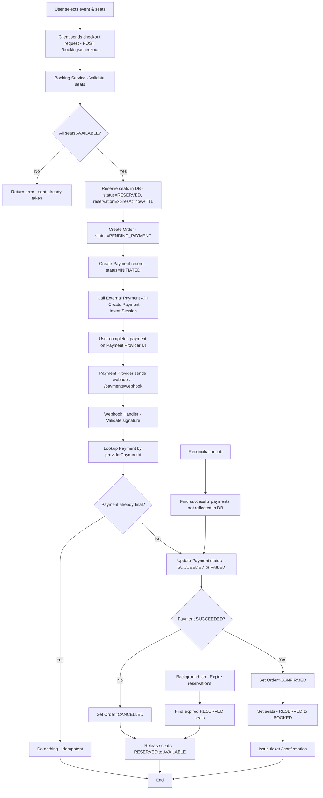

Use the 4 steps to define the product, sketch the flow, then deep‑dive payments and seat locking.

**Step 1: Clarify the requirements** 
You’d start by restating and scoping:
“We’re designing a backend to **book a seat for a concert event**, with emphasis on two things: integrating with an external payments provider and correctly reserving seats so there are no double‑bookings.”
Then quickly clarify:
- Product scope:  
    Users browse events and seats elsewhere; here we focus on “select seat → pay → confirm ticket”. Is cancellation / refund in scope? Is partial payment or promo codes in scope?
- Scale:  
    How many concurrent users around peak (e.g., big on‑sale moment)? Latency target for checkout (e.g., under 2–3 seconds typical, <10 seconds worst‑case)?
- Constraints:  
    Do we control the external booking/payment API or is it a 3rd‑party gateway? Is it synchronous (immediate result) or async (webhooks)? Are we allowed eventual consistency for some parts as long as we never oversell a seat?
- Non‑functionals:  
    Strong requirement: “never sell the same seat twice”. High availability during big drops. Auditable payment logs.
Then you summarize assumptions aloud:
“I’ll assume single region, web/mobile clients, a 3rd‑party payment API with webhooks, and a hard rule that we never confirm two users for the same seat, even if that slightly increases latency.”

**Step 2: High‑level design** 
Now you sketch the main components and basic flow, staying high‑level.
Describe a simple architecture:
- Clients call a **Booking Service API** (behind a load balancer).
- Booking Service uses:
- A relational **Bookings DB** (Events, Seats, Reservations, Orders, Payments).
- A **Seat Reservation component** that can lock seats briefly.
- An **External Payment Integration** component talking to the Payment Provider API.
- Optionally a **Message Queue** for async workflows like handling payment webhooks.

Then walk through the **happy path** at a high level:

1. User selects event + specific seat(s) in the UI.
2. Client calls `POST /bookings/checkout` with eventId, seatIds, userId.
3. Booking Service:

- Validates seats are available.
- Temporarily reserves them (seat lock with expiry).
- Creates an `Order` record in `PENDING_PAYMENT` state.
- Calls external payment API to create a payment session/intent.

5. External payment provider handles card entry UI or redirect.
6. On success, provider calls our webhook or client returns a success token.
7. Booking Service finalizes:

- Confirms payment.
- Marks seats as `BOOKED`.
- Marks order as `CONFIRMED`.
- Issues ticket / confirmation.

Quick checkpoint phrase:  
“If this overall flow makes sense, I’ll deep dive two parts: how we prevent double‑booking when many users try to grab the same seat, and how we integrate safely with the external payment API.”

**Step 3: Deep dive – seat booking / locking** 
You now go into specific design choices for seats.
Explain the **data model** briefly:
- Event(eventId, venueId, startTime…)
- Seat(seatId, eventId, row, number, status: AVAILABLE | RESERVED | BOOKED, …)
- Order(orderId, userId, eventId, status: PENDING_PAYMENT | CONFIRMED | CANCELLED, totalAmount, …)
- Payment(paymentId, orderId, status: INITIATED | SUCCEEDED | FAILED, providerRef, …)
Then focus on how to **lock seats to avoid double‑booking**.
You can describe one concrete approach:
- When the user starts checkout, the Booking Service runs an atomic operation:
- Check that each requested seat is in status `AVAILABLE`.
- Change them to `RESERVED` with a `reservationExpiresAt` timestamp (e.g., now + 10 minutes).
- Use DB transactions and constraints:
- In SQL, `UPDATE Seats SET status='RESERVED', reservationExpiresAt=... WHERE seatId IN (...) AND status='AVAILABLE'`.
- If the number of updated rows < requested seats, fail the reservation (someone else beat them).
- A background job:
- Periodically scans for seats where `status='RESERVED'` and `reservationExpiresAt < now`, and sets them back to `AVAILABLE`.
Explain concurrency/failure behavior:
- Race: two users try to grab same seat. Only one `UPDATE … WHERE status='AVAILABLE'` will succeed; the other sees fewer updated rows and gets an error like “seat already taken”.
- If user drops off after reserving but before paying:
- Seat stays `RESERVED` until `reservationExpiresAt`, then automatically becomes `AVAILABLE` again.
- If payment succeeds but final step fails temporarily:
- We have a payment success record; a reconciliation job or retry finalizes booking and seat status.

Mention scaling:
- ==For very high traffic, we can shard Seats by `eventId` or venue(all seats for Concert A live in one database partition, and all seats for Concert B live in another), and/or use row‑level locking in the DB.== If needed, we could introduce a lightweight in‑memory lock (Redis) but still treat the DB as the source of truth.

**Step 3 (continued): Deep dive – external payment API** 
Now you zoom into payment integration, with attention to correctness and idempotency.
Describe the **payment flow** in more detail:
1. After seats are reserved, Booking Service creates an `Order` with `status = PENDING_PAYMENT`.
2. It calls the external Payment Provider:

- `CreatePaymentIntent(orderId, amount, currency, userId, callbackUrl)`
- Store `providerPaymentId` and set Payment record to `INITIATED`.

4. User completes payment via provider’s UI.
5. Provider notifies us via:

- A **synchronous redirect** back to our app with a token, and/or
- An **asynchronous webhook** (`/payments/webhook`).

You then show how you’d handle the webhook robustly:

- Webhook handler:

- Validates signature to ensure authenticity.
- Looks up Payment record by `providerPaymentId`.
- Uses **idempotent updates**:

- If already `SUCCEEDED` or `FAILED`, do nothing.
- Otherwise update status to `SUCCEEDED` or `FAILED` based on provider payload.

- For `SUCCEEDED`:

- Transition associated Order from `PENDING_PAYMENT` to `CONFIRMED`.
- Transition associated Seats from `RESERVED` to `BOOKED`.

Important points to highlight:

- **Idempotency**:  
    Provider may send the same webhook multiple times; our handler must be safe to re‑run without double‑booking or double‑charging.
- **Timeout / mismatched states**:  
    If payment succeeds but our webhook endpoint is down, provider retries. Until we process, Order remains `PENDING_PAYMENT` and seats stay `RESERVED`. ==A reconciliation job checks for successful provider payments that haven’t yet updated our DB and fixes them.==
- **Security**:  
    Only our backend talks to the payment provider with secrets; the client never sees API keys.

You can also mention failure scenarios:

- Payment fails or user cancels:

- Payment record is `FAILED`.
- Order goes to `CANCELLED`.
- Seats are released immediately (set back to `AVAILABLE`).

- Payment success but seat reservation expired:

- This is a “shouldn’t happen” case if the expiry is long enough. If it does, we rely on strict ordering: we don’t auto‑expire reserved seats for orders that are still in `PENDING_PAYMENT` with a recent payment activity, or we reconcile based on timestamps.

**Step 4: Bottlenecks and tradeoffs** 
Now you wrap it up by explicitly calling out what can break and what tradeoffs you chose.
Discuss bottlenecks:
- ==Hot rows: Very popular seats or sections cause contention on the Seats table. Sharding by event or careful indexing mitigates this.==
- DB throughput: All seat reservations and bookings hit the central DB. ==For huge events,== we might partition by eventId or ==put different venues in different DB clusters.==
- ==External payment latency: Payment provider slowness increases checkout time. Using async webhooks and having the UI poll “payment status” helps keep the system responsive.==

Discuss tradeoffs:
- Strong consistency on seat allocation vs user experience:  
    We chose DB‑backed seat locking with transactions to guarantee no double‑booking, at the cost of slightly higher write contention and complexity.
- Reservation timeout duration:  
    Longer time windows are nicer for users but keep seats blocked; shorter time windows reduce abandonment but may frustrate slow users.
- Sync vs async confirmation:  
    Relying on webhooks improves reliability, but introduces more complexity and potential delays in “payment succeeded → booking confirmed”.

End with a concise summary in interview style:
“In this design, the core is a transactional seat reservation system with expiring locks, plus an idempotent integration with an external payment API via webhooks. This guarantees we **never double‑book seats**, and we treat payment and ticket confirmation as a small state machine around Orders and Seats. If we needed to scale to massive on‑sales, we’d further shard seats by event and potentially add an in‑memory reservation layer, but still keep the DB as the authoritative source of which seats are booked.”

